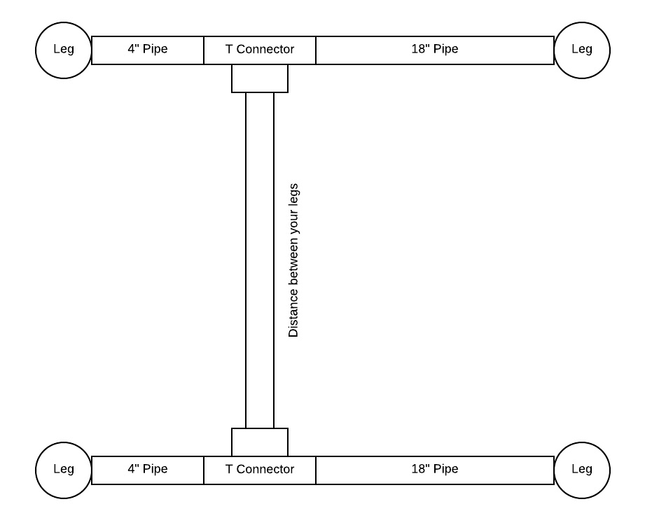

Recently I built a butcher block and iron pipe desk for my home office.  Within this post i'll try and list out how I approached it as best as possible:

I purchased 2 8ft butcher block countertops from Lumber Liquidators while they were on sale. I [paid $150 for each](https://www.lumberliquidators.com/ll/c/%27-Builder-Oak-Countertop-Williamsburg-Butcher-Block-Co.-OAKBB8L-H/10037933). Next, I researched quite a bit about how to finish them. Here's what I did:

* Sanded using 80 grit sandpaper
* Sanded using 120 grit sandpaper
* Sanded using 200 grit sandpaper
* Sanded using 320 grit sandpaper
* Sanded using 400 grit sandpaper

Once that was done, I used cheese cloth to wipe away all the debris. After that I did some more research and found a really cool product tha tturned out amazing (highly recommend). This product is unique, mostly because it is a finisher, sealer, and protector all in one. I was skeptical but I can not recommend this enough. Another point is that if you use typical stain and then polyurethe you are not actually touching the wood - it's more of a coating. This stuff you are actually touching the wood cause the tung oil and sealer penetrates the actual wood; no rings from glasses, no oily residue, nothing. Its seriously great.

Now, to the product: [WaterLox](https: //www.waterlox.com/products-item/waterlox-original-penetrating-tung-oil-floor-sealer-finish)
I put 2 coats of this on. Each coat takes 24 hours to dry and you should make sure that where ever you do this, you need to ventilate really well. Also, you MUST wear a respirator when opening, using, etc. I ended up just buying [this one](https: //www.lowes.com/pd/3M-Reusable-Painting-Valved-Safety-Mask/1000039613)

I applied it using a natural paint brush from lowes (not the nylon type, but the sand color brush). I did 1 coat then waited (leaving my garage open for the day) and then applied the second coat. After that, I wanted a less shiny look so I applied [1 coat of their Satin product](https://www.waterlox.com/products-item/waterlox-original-satin-tung-oil-wood-floor-finish)

I did this cause I actually plan to use the remaining for other projects in the future. Once that is all dried (again 24 hours) I was ready to build out my iron pipe frame.

My new home office is a little odly shaped but I knew I wanted a L shaped desk but I was worried about the weight of the butcherblocks (they wieght like 150-200lbs each). So I decided to go with the 3/4" black iron pipe. Here's a general layout of my office:

I used [these flanges](https://www.lowes.com/pd/Mueller-Proline-3-4-in-dia-Black-Iron-Floor-Flange-Fitting/1000217677) for both the feet and to attach to the butcher block top.

These are represented by the circles in this image:

So I have 7 legs for my desk and from the bottom to the top goes like this:

* [Flange](https: //www.lowes.com/pd/Mueller-Proline-3-4-in-dia-Black-Iron-Floor-Flange-Fitting/1000217677)
* 1.5" 3/4 iron pipe (in the same location at Lowes)
* 3/4 Iron Pipe T: https: //www.lowes.com/pd/LDR-Black-Iron-Tee-Fitting/3464002
* 24" Iron Pipe (threaded on both sides - all of these are threaded on both sides). I ended up buying 2 10ft long pipes and had the guy at lowes cut 7 of them for my legs
* Flange

Now to connect together. This was a little tricky but it's working great so far. Between a pair of legs (there's 3 pair of legs and then a single leg) I bought a 4" black pipe (it was easier instead of trying to cut our own) and then added a 3/4 Iron Pipe T (this is what connects the two pairs of legs together) and then added a 16" (or 18" - can't remember) to connect to the other leg in the pair. This is shown below:

Here is a overall view of all the piping from above (these mesurements are not 100% exact but I think you get the gist).

Last few things. I have hardwood floors and I didn't want the flange pieces that were going to touch the ground to scratch anything so I bought some "no skid" pads (opposite of moving furntiure pads) and cut them out to fit underneath the flanges.

Since I have 2 8ft pieces, I had to cut one slightly down to fit my space (this is all dependent on your measurements). But I did connect the two pieces once in place. I used 2 12" by 6" Stainless Steel plates that had wholes in them. My dad had these (for some reason) so we used them but you can find something like this https://www.lowes.com/pd/USP-7-in-Wood-to-Wood-Nail-Plate/3374508

I also used 3/4" Hard Backer Board screws to attach the top of the legs (the flange plate) to the top of the butcher block top to ensure that it stayed in place.

That's it. I hope this gives some details and help! Good luck!
