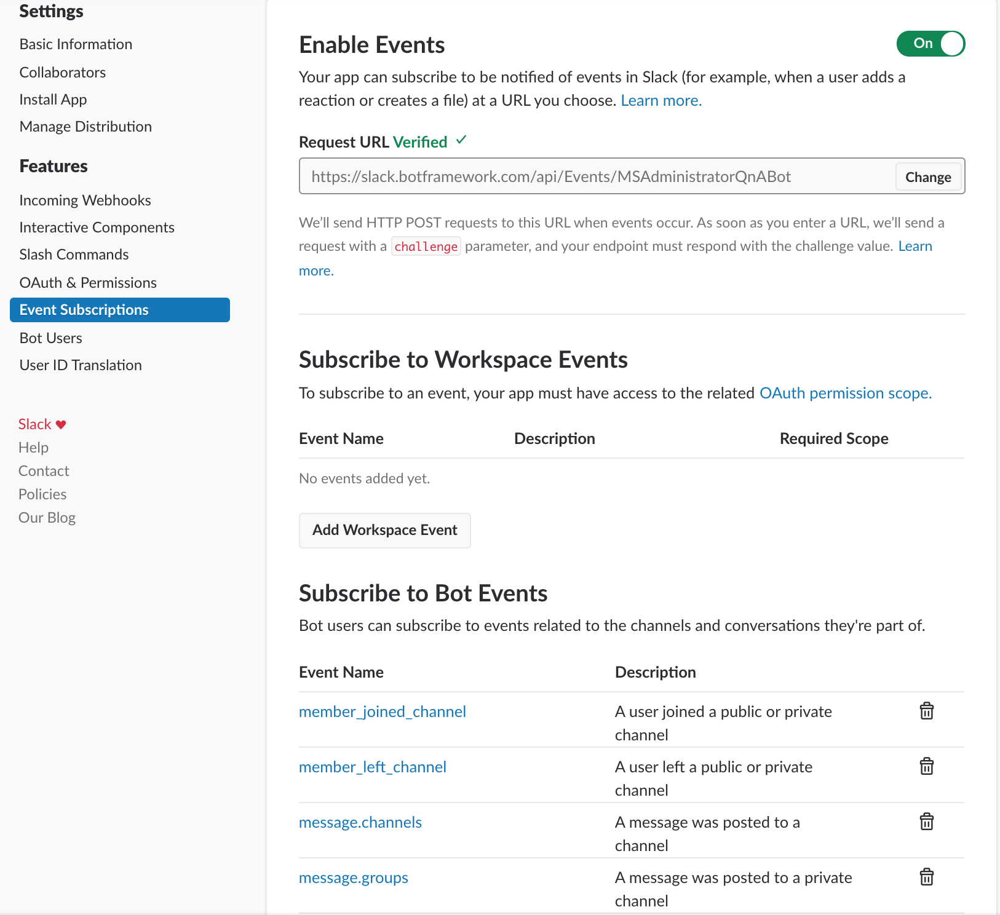
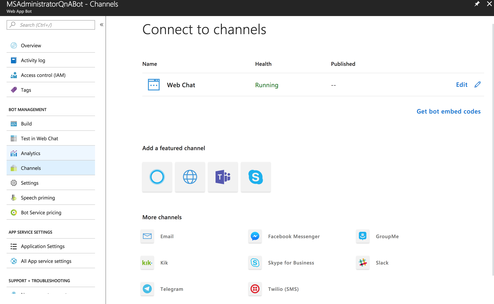
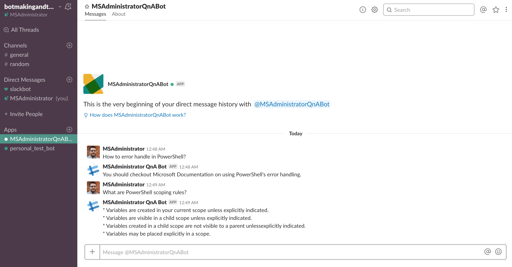

In my previous two posts we created a knowledge base of questions and answers using QnAMaker and we created our Web App Bot in the Azure Portal.  Now that we have a bot created and it is responding as we intended, we can interact with our bot directly through our web browser (or embed it into a website) or we can integrate into our Slack workspace.  

Please make sure you have a Slack workspace created and you have access to create a Slack application.  [Login to your Slack workspace API](https://api.slack.com/apps) and select Create New App in the top right-hand corner.  You will need to give your new application a name and select the appropriate workspace to create your new application.

After your New App is created, select OAuth & Permissions and select Add.  Enter the following Redirect URL: [https://slack.botframework.com](https://slack.botframework.com) and click Save.

Next, go to Bot Users and select Add a Bot.  Give your bot a username and toggle the Always Show My Bot as Online button so that it says On.
  
Go to Events Subscription and select Enable Events.  Once there, enter the following URL and replace the {botname} with the name of your bot.

https://slack.botframework.com/api/Events/{botname}

If you are unsure of your bot’s name, you can find it under the My Bots section at [https://slack.botframework.com](https://slack.botframework.com).

Lastly, you will need to subscribe to (at minimum) the following bot events.

* member_joined_channel
* member_left_channel
* message.channels
* message.groups
* message.im
* message.mpim

Click Save.

Select the Basic Information section scroll down until you see the App Credentials.  You will need to gather the following information to allow your Azure Web App Bot to be integrated into your Slack workspace.

* Client ID
* Client Secret
* Verification Token

Now that you have this information, head back over to your Azure Portal and your Web App Bot.  Once you are back there, select the Channels setting. 

I want to point out that you can integrate your bot with many other services besides Slack, and there are several built-in options for doing this with many popular services.  This article will only talk about integrating your bot with Slack.

Enter Application Credentials information from our Slack workspace into the Slack channel integration page on your Web App Bot Resource in the Azure Portal.  You only need to fill out the Client ID, Client Secret, and Verification Token fields.  Click Save.

You should be presented with a Verification page authorizing your bot to interact with your Slack workspace.

NOTE: If you run into an issue, you may need to ensure that you are still authorized/logged in by visiting [https://slack.botframework.com](https://slack.botframework.com).  

All you have to do now is login to your Slack workspace and your new bot should be available and ready to answer any and all of your questions! 

