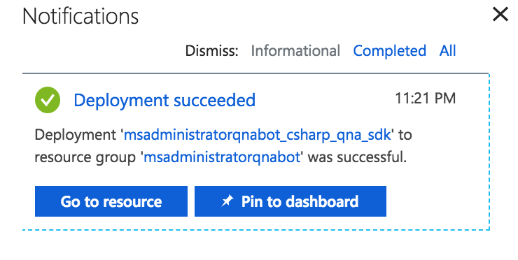
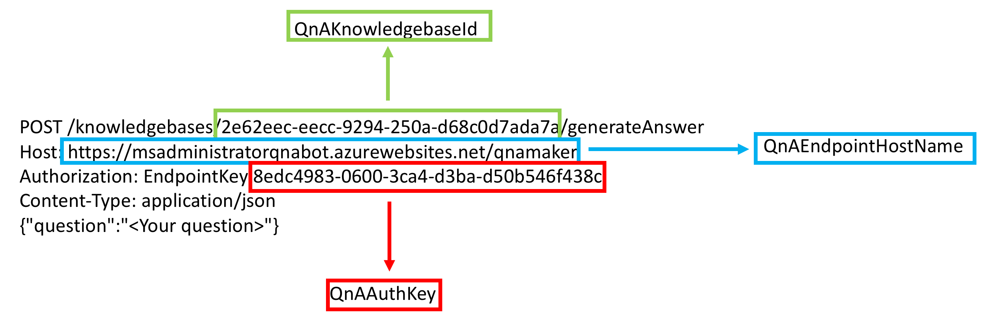

In my last post, we create a QnA Maker knowledge base that our Azure Web App Bot will use as it’s repository of questions & answers.  Now, we are going to create our bot using Azure’s Bot Services.

First thing is that we should go ahead and log into the [Azure Portal](https://portal.azure.com).  In the top left-hand corner click the Create a resource button.  You will then need to Search the marketplace in the New blade for Web App Bot.  

Select Web App Bot from the list.  You will then be presented with a new blade and asked to Create the resource.  Click the Create button now.

Before the Web App Bot is created, you need to fill in the required fields.  Most of these fields are straight forward but some need further explanation.

You will need to give your Web App Bot a name and select your Subscription plan.  Next, you should select your Resource Group (which was created previously), Location, Pricing tier, and App name.

Next, you need to select a Bot Template.  Click the Bot template section and new blade will slide out.  There are several different Bot templates to choose from but the one that we need to select for our QnAMaker bot is the Question and Answer bot template.

Now, click Create to create your Web App Bot.

You will be redirected to the Azure dashboard.  You will be notified that your Web App Bot has been created successfully in the notification center (looks like bell).  Select the notification icon and click Go to resource.

Select the Test in Web Client section in your Web App Bot resource blade and enter any text you like.  You should receive the following output:

Please set QnAKnowledgebaseId, QnAAuthKey and QnAEndpointHostName (if applicable) in App Settings. Learn how to get them at [https://aka.ms/qnaabssetup](https://aka.ms/qnaabssetup)

If you remember from the previous post I mentioned that we will need the information presented to you when you created your QnAMaker knowledge base.  We will use this information now.

First, select the Application Settings section and scroll down until you see a list of application settings.  You should see the following settings next to each other:

* QnAAuthKey
* QnAEndpointHostName
* QnAKnowledgebaseId

These three settings will need a value from our Sample HTTP request from the https://qnamaker.ai website. 

Enter your values into the Application Settings pane on your Web App Bot resource and click Save.  Next, let’s test out our new Web App Bot.  Go to Test in web client again and ask your bot a question.

