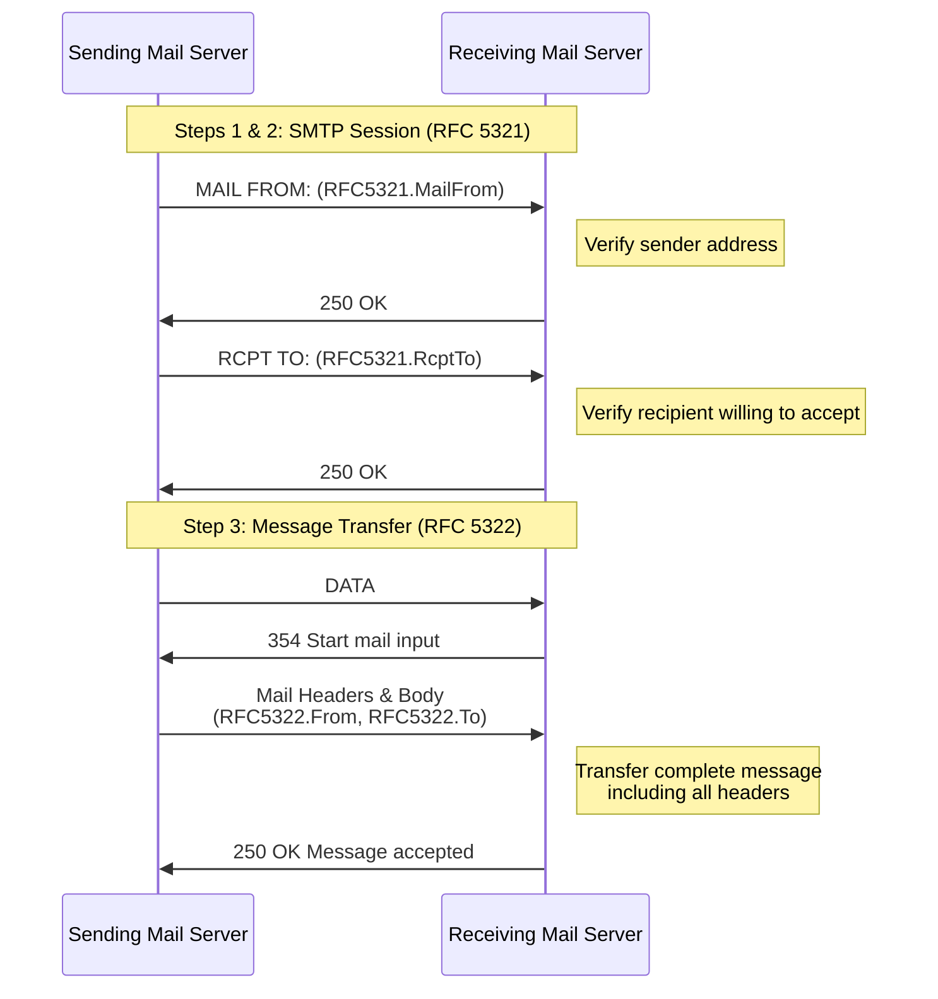

After reading Microsoft's excellent blog post [Phishing actors exploit complex routing and misconfigurations to spoof domains](https://www.microsoft.com/en-us/security/blog/2026/01/06/phishing-actors-exploit-complex-routing-and-misconfigurations-to-spoof-domains/), I wanted to dive deeper and provide additional guidance for understanding common concepts found within Microsoft email headers. This post extends the referenced blog by focusing specifically on phishing detection opportunities within these headers.

If you've worked in email security for any duration, you know that email headers are a goldmine of information. The challenge is knowing what to look for and how to interpret it. Let's break this down.

## Understanding Key Microsoft Headers

Before we dive into detection rules, let's understand some of the key headers Microsoft uses in Exchange Online. These headers tell a story about where a message came from and how it was authenticated.

| Header | Value | Notes |
| --- | --- | --- |
| `X-MS-Exchange-Organization-InternalOrgSender` | `True` | Combined with `Incoming` directionality, indicates spoofing (not necessarily malicious) |
| `X-MS-Exchange-Organization-MessageDirectionality` | `Incoming` | Message was sent from outside the organization |
| `X-MS-Exchange-Organization-ASDirectionalityType` | `1` | Indicates external origin |
| `X-MS-Exchange-Organization-AuthAs` | `Anonymous` | If set alongside other external indicators, confirms external source |

These headers become particularly interesting when their values contradict each other. An `InternalOrgSender` of `True` combined with `Incoming` directionality? That's worth investigating.

## The Authentication-Results Header

When it comes to detecting spoofing and authentication issues, the `Authentication-Results` header is your primary source of truth. You can read the full RFC [here](https://datatracker.ietf.org/doc/html/rfc7001), but let me break down what matters for threat detection.

Here's a typical format of this header:

```text
spf=pass (sender IP is 2607:f8b0:4864:20::112d)
 smtp.mailfrom=gmail.com; dkim=pass (signature was verified)
 header.d=gmail.com;dmarc=pass action=none header.from=gmail.com;compauth=pass
 reason=100
```

The header starts with `spf=` followed by one of several values. For detection purposes, we focus on the later portions: `dmarc=pass action=none` and `compauth=pass reason=100`. These give us several detection opportunities.

### SPF, DKIM, and DMARC Values

| Authentication Type | Supported Values | Notes |
| --- | --- | --- |
| SPF (Sender Policy Framework) | pass, fail, softfail, neutral, none, temperror, permerror | Verifies RFC5321 `Mail From` address |
| DKIM (DomainKeys Identified Mail) | pass, fail, none, temperror, permerror | Verifies RFC5322 `From` address |
| DMARC (Domain-based Message Authentication, Reporting & Conformance) | pass, fail, none | Combines SPF and DKIM results |

Many organizations don't set up SPF, DKIM, and DMARC correctly or enforce `reject` within their policies. Let's fix that knowledge gap.

## SPF Configuration

For SPF, organizations need to set up a TXT DNS record for their email domain. The format looks like:

```text
v=spf1 <mail sources> <rule>all
```

There are three options for the `rule` and they're all punctuation:

- `-` → Hard Fail
- `~` → Soft Fail  
- `?` → Neutral

So for example, if you're using Office 365, your TXT record will look like:

```text
v=spf1 include:spf.protection.outlook.com -all
```

If you don't set up this record, it results in `spf=none` within your `Authentication-Results` header. For detection, we don't care much about `pass` or `none` (can't fix external domains), but we care about `fail`, `softfail`, and `temperror` since these indicate something went wrong during SPF validation.

## DKIM Configuration

DomainKeys Identified Mail (DKIM) validates that email content hasn't been altered in transit. DKIM uses a public/private key pair. You generate the pair and store the public key in a CNAME DNS record. Check [Microsoft's documentation](https://learn.microsoft.com/en-us/defender-office-365/email-authentication-dkim-configure) for setup details.

Because DKIM is more involved than SPF and DMARC, we're not incorporating specific detection mechanisms for it in this post.

Example DKIM CNAME DNS records:

```text
Hostname: selector1._domainkey
Points to: selector1-{yourdomain}-com._domainkey.{yourdomain}.com

Hostname: selector2._domainkey
Points to: selector2-{yourdomain}-com._domainkey.{yourdomain}.com
```

## DMARC Configuration

DMARC is where things get interesting because the combination of SPF and DKIM ultimately determines the DMARC result for a given email.

Just like SPF, you'll create a TXT record for DMARC:

| Record Key | Value | Notes |
| --- | --- | --- |
| Hostname | `_dmarc` | |
| TXT Value | `v=DMARC1; p=reject; pct=100; rua=mailto:rua@contoso.com; ruf=mailto:ruf@contoso.com` | v=version, p=action (reject/quarantine/none), pct=percentage, rua=aggregate report, ruf=failure report |

When configured correctly, DMARC validates that either SPF or DKIM (or both) passed authentication.

## SPF, DKIM, and DMARC Truth Table

Understanding how these work together is critical. DMARC passes if either SPF or DKIM passes.

| SPF | DKIM | DMARC Result | Notes |
| --- | --- | --- | --- |
| Pass | Pass | Pass | Both authentication methods passed |
| Pass | Fail | Pass | SPF passed, DKIM failed - DMARC still passes |
| Pass | None | Pass | SPF passed, no DKIM configured - DMARC passes |
| Fail | Pass | Pass | SPF failed, DKIM passed - DMARC still passes |
| Fail | Fail | Fail | Both authentication methods failed - DMARC fails |
| Fail | None | Fail | SPF failed, no DKIM - DMARC fails |
| None | Pass | Pass | No SPF configured, DKIM passed - DMARC passes |
| None | Fail | Fail | No SPF configured, DKIM failed - DMARC fails |
| None | None | None/Fail | Neither configured - DMARC typically fails |
| Softfail | Pass | Pass | SPF softfail, DKIM passed - DMARC passes |
| Softfail | Fail | Fail | SPF softfail treated as fail, DKIM failed - DMARC fails |

**Key Takeaway:** DMARC requires at least one of SPF or DKIM to pass for the overall check to pass. This is known as DMARC alignment. If both fail (or aren't configured), DMARC fails and the action specified in the DMARC policy applies.

## Email Flow Diagram

Understanding the SMTP session helps clarify why we have both RFC5321 and RFC5322 addresses:



SPF verifies that the RFC5321 `Mail From` address isn't spoofed, while DKIM verifies that the RFC5322 `From` address isn't spoofed. DMARC ties them together. This is one of main benefits of DMARC when it comes to verification of authentication.

## Composite Authentication Reason Codes

Using the `Authentication-Results` header, we can extract details about the authentication reason based on Microsoft's [reason codes](https://learn.microsoft.com/en-us/defender-office-365/message-headers-eop-mdo#composite-authentication-reason-codes).

Here are the key codes for detection:

| Code | Description | Detection Notes |
| --- | --- | --- |
| 108 | DKIM failed due to message body modification from previous legitimate hops | Possible on-prem modification |
| 451 | Complex routing with `oreject` means message was delivered to spam | From Microsoft's blog |
| 601 | Sending domain is an accepted domain (self-to-self or intra-org spoofing) | Aligns with code `010` |
| 905 | DMARC wasn't enforced due to complex routing | On-prem Exchange or third-party service routing |

## Detection Rules

Now let's get to the good stuff. Here are detection rules for identifying authentication failures that may indicate phishing attempts.

### Detecting Authentication Failures with Weak DMARC Policies

This rule catches authentication failures that "slipped through" due to weak DMARC/SPF policies—messages that should have been blocked but only made it to junk mail. These represent potential spoofing attempts against domains without strict enforcement.

```javascript
type.inbound
and any(filter(headers.hops, .index == 1),
        any(.fields,
            .name == "Authentication-Results"
            and (
              regex.contains(.value, 'dmarc=(fail|none)\saction=none')
              or regex.contains(.value,
                                'spf=(fail|softfail|temperror)\s\(sender\sIP\sis\s'
              )
            )
            and (
              // MX record points to on-premises Exchange environment
              // or third-party service before reaching Microsoft 365
              // but message delivered to spam folder
              strings.contains(.value, 'reason=451')
            )
            and not (
              // exclude passes
              regex.contains(.value, 'spf=(pass)\s\(sender\sIP\sis\s')
              // ignore proper action type when dmarc fails
              or regex.contains(.value, 'dmarc=fail\saction=oreject')
              // excluding properly configured dmarc failures
              // failed explicit email authentication
              or strings.contains(.value, 'reason=000')
              // failed implicit email authentication
              or strings.contains(.value, 'reason=001')
            )
        )
)
```

### Detecting Bypassed Enforcement via Tenant Allow Policies

This catches DMARC/SPF authentication failures that bypassed enforcement due to tenant allow policies (`reason=905`). These are messages that failed authentication but were delivered because an admin policy explicitly permitted them. This could indicate overly permissive allow-lists being exploited by attackers spoofing "trusted" domains.

```javascript
type.inbound
and any(filter(headers.hops, .index == 1),
        any(.fields,
            .name == "Authentication-Results"
            and (
              regex.contains(.value, 'dmarc=(fail|none)\saction=none')
              or regex.contains(.value,
                                'spf=(fail|softfail|temperror)\s\(sender\sIP\sis\s'
              )
            )
            and (
              // MX record points to on-premises Exchange environment
              // or third-party service before reaching Microsoft 365
              strings.contains(.value, 'reason=905')
            )
            and not (
              // exclude passes
              regex.contains(.value, 'spf=(pass)\s\(sender\sIP\sis\s')
              // ignore proper action type when dmarc fails
              or regex.contains(.value, 'dmarc=fail\saction=oreject')
              // excluding properly configured dmarc failures
              // failed explicit email authentication
              or strings.contains(.value, 'reason=000')
              // failed implicit email authentication
              or strings.contains(.value, 'reason=001')
            )
        )
)
```

### Detecting Domain Spoofing Attempts

This detects DMARC/SPF failures where the attacker attempted to spoof your own domain (`reason=601`—intra-org/self-to-self spoofing). This is a direct indicator of domain spoofing attacks targeting internal trust.

```javascript
type.inbound
and any(filter(headers.hops, .index == 1),
        any(.fields,
            .name == "Authentication-Results"
            and (
              regex.contains(.value, 'dmarc=(fail|none)\saction=none')
              or regex.contains(.value,
                                'spf=(fail|softfail|temperror)\s\(sender\sIP\sis\s'
              )
            )
            and (
              // tried to impersonate within same domain but failed authentication
              strings.contains(.value, "reason=601")
            )
            and not (
              // exclude passes
              regex.contains(.value, 'spf=(pass)\s\(sender\sIP\sis\s')
              // ignore proper action type when dmarc fails
              or regex.contains(.value, 'dmarc=fail\saction=oreject')
              // excluding properly configured dmarc failures
              // failed explicit email authentication
              or strings.contains(.value, 'reason=000')
              // failed implicit email authentication
              or strings.contains(.value, 'reason=001')
            )
        )
)
```

## X-Forefront-Antispam-Report

If you're using Microsoft 365 or have cloud mailboxes (and who isn't now?), you'll see this header within your messages. This information is extremely useful for identifying how your detection strategies perform compared to Microsoft's global system.

For example, we can identify scenarios where we haven't marked something as spam but Microsoft has categorized it as such. See the [full list of categories](https://learn.microsoft.com/en-us/defender-office-365/message-headers-eop-mdo#x-forefront-antispam-report-message-header-fields).

### Detecting Spam Categorization

```javascript
type.inbound
and any(headers.hops,
        (
          any(.fields,
              .name == "X-Forefront-Antispam-Report"
              and (
                // High confidence spam
                strings.contains(.value, "CAT:HSPM")
                // Outbound spam
                or strings.contains(.value, "CAT:OSPM")
                // General spam
                or strings.contains(.value, "CAT:SPM")
                // spam because it matched a sender in the blocked senders list
                // or blocked domains list in an anti-spam policy
                or strings.contains(.value, "SFV:SKB")
                // The message was marked as spam before processing by spam filtering
                or strings.contains(.value, "SFV:SKS")
                // The message was marked as spam by spam filtering
                or strings.contains(.value, "SFV:SPM")
                // identified as bulk by spam filtering
                // and the bulk complaint level (BCL) threshold
                or strings.contains(.value, "SRV:BULK")
              )
              and not (strings.contains(.value, "CAT:NONE;"))
          )
        )
)
```

### Detecting Impersonation Categories

```javascript
type.inbound
and any(headers.hops,
        (
          any(.fields,
              .name == "X-Forefront-Antispam-Report"
              and (
                // Mailbox intelligence impersonation policy applied
                strings.contains(.value, "CAT:GIMP")
                // identified as phishing but intra org impersonation
                or strings.contains(.value, "SFTY:9.11")
                // identified as phishing and domain impersonation
                or strings.contains(.value, "SFTY:9.19")
                // identified as phishing and User impersonation
                or strings.contains(.value, "SFTY:9.20")
                // identified as phishing but cross domain spoofing
                or strings.contains(.value, "SFTY:9.22")
                // SPOOF
                or strings.contains(.value, "CAT:SPOOF")
                // User impersonation
                or strings.contains(.value, "CAT:UIMP")
              )
              and not (strings.contains(.value, "CAT:NONE;"))
          )
        )
)
```

### Detecting Phishing Categories

This is great for finding gaps in detection coverage that Microsoft has flagged as phishing:

```javascript
type.inbound
and any(headers.hops,
        (
          any(.fields,
              .name == "X-Forefront-Antispam-Report"
              and (
                // High confidence phishing
                strings.contains(.value, "CAT:HPHISH")
                // identified as phishing but intra org impersonation
                or strings.contains(.value, "SFTY:9.11")
                // identified as phishing and domain impersonation
                or strings.contains(.value, "SFTY:9.19")
                // identified as phishing and User impersonation
                or strings.contains(.value, "SFTY:9.20")
                // identified as phishing but cross domain spoofing
                or strings.contains(.value, "SFTY:9.22")
                // First contact safety tip
                or strings.contains(.value, "SFTY:9.25")
              )
              and not strings.contains(.value, "CAT:NONE;")
          )
        )
)
```

### Detecting Allow List Misconfigurations

This helps identify messages that bypassed filtering due to allow lists:

```javascript
type.inbound
and any(headers.hops,
        (
          any(.fields,
              .name == "X-Forefront-Antispam-Report"
              and (
                // skipped spam filtering since source IP address was in allow list
                strings.contains(.value, "IPV:CAL")
                // released from quarantine & sent to the intended recipients
                or strings.contains(.value, "SFV:SKQ")
                // Filtering skipped and was blocked because it was sent
                // from an address in a user's Blocked Senders list
                or strings.contains(.value, "SFV:BLK")
              )
              and not (strings.contains(.value, "CAT:NONE;"))
          )
        )
)
```

## X-Microsoft-Antispam

This header helps determine if the sender has a high Bulk sender rate. You can find the [BCL values table here](https://learn.microsoft.com/en-us/defender-office-365/anti-spam-bulk-complaint-level-bcl-about).

```javascript
type.inbound
and any(headers.hops,
    (
        any(.fields,
            .name == "X-Microsoft-Antispam"
            and (
            // bulk sender that generates a high number of complaints
            regex.contains(.value, 'BCL:[8-9]')
            )
        )
    )
)
```

## X-MS-Exchange-Organization-SCL

This header provides Microsoft's Spam Confidence Level determination. For the highest confidence spam:

```javascript
type.inbound
and any(headers.hops,
        (
          any(.fields,
              .name == "X-MS-Exchange-Organization-SCL"
              // highest spam confidence level
              and .value == "9"
          )
        )
)
```

For medium SCL levels:

```javascript
type.inbound
and any(headers.hops,
        (
          any(.fields,
              .name == "X-MS-Exchange-Organization-SCL"
              and (
                // medium spam confidence level
                regex.match(.value, '[5-8]')
              )
          )
        )
)
```

## X-MS-Exchange-Organization-PCL

Same concept but for Phishing Confidence Level:

```javascript
type.inbound
and any(headers.hops,
        (
          any(.fields,
              .name == "X-MS-Exchange-Organization-PCL"
              and (
                // The message content is likely to be phishing
                regex.contains(.value, '[4-8]')
              )
          )
        )
)
```

## X-Microsoft-Antispam-Mailbox-Delivery

This header reveals how Microsoft determined delivery destination and what filters were applied:

```text
ucf:0;jmr:0;auth:0;dest:J;OFR:SpamFilterAuthJ;ENG:(910005)(944490095)(944506478)(944626604)(4710137)(4715077)(4999163)(920097)(930201)(3100021)(140003);RF:JunkEmail;
```

Key field values:

| Field | Value | Description |
| --- | --- | --- |
| auth | 0 | Authentication failed |
| auth | 1 | Authentication passed |
| ucf | 1 | User controlled filtering enabled |
| jmr | 0 | Junk mail filtering - No |
| dest | J | Server-side decision to deliver to Junk Mail |
| dest | I | Server-side decision to deliver to INBOX |
| dest | C | Server-side decision to deliver to custom folder |
| OFR | CustomRules | Outlook rule determined delivery |
| OFR | SpamFilterAuthJ | Exchange determined delivery |
| wl | 1 | Sender or recipient on white list |
| wl | 0 | Sender is not on a whitelist |
| pcwl | 1 | Policy controlled white list |
| rwl | 1 | Recipient on recipient white list |
| abwl | 1 | Auto-block white lists |
| dwl | 1 | Domain white list |
| RF | JunkEmail | Reason failure |

### Detecting Whitelisted Malicious Messages

This identifies messages on a white list that were delivered to the inbox. Good for finding messages flagged as malicious that bypassed controls due to whitelist configuration:

```javascript
type.inbound
and any(headers.hops,
        (
          any(.fields,
              .name == "X-Microsoft-Antispam-Mailbox-Delivery"
              and (
                // Sender or recipient on white list and considered safe
                strings.contains(.value, "wl:1")
                // Sender or recipient on policy controlled white list
                or strings.contains(.value, "pcwl:1")
                // Recipient on recipient white list
                or strings.contains(.value, "rwl:1")
                // sender on Auto-block white lists
                or strings.contains(.value, "abwl:1")
                // Sender on domain white list
                or strings.contains(.value, "dwl:1")
              )
              // server side delivered the message to the users mailbox
              and strings.contains(.value, "dest:I;")
              // and the message was delivered (not to junk mail)
              and not (
                // Server-side decision to deliver to Junk Mail
                strings.contains(.value, "dest:J;")
              )
          )
        )
)
```

### Detecting User-Controlled Filter Bypasses

This finds messages delivered to custom folders based on user-controlled filters, which could indicate custom mail rules or content filters:

```javascript
type.inbound
and any(headers.hops,
        (
          any(.fields,
              .name == "X-Microsoft-Antispam-Mailbox-Delivery"
              and (
                // User controlled filter was set to True
                strings.contains(.value, "ucf:1")
              )
              // server side delivered the message to custom folder
              and strings.contains(.value, "dest:C;")
              // and the message was delivered (not to junk mail)
              and not (
                // Server-side decision to deliver to Junk Mail
                strings.contains(.value, "dest:J;")
              )
          )
        )
)
```

## X-MS-Exchange-Organization-AuthAs

This header has two values: `Anonymous` and `Internal`. Anonymous means no authentication occurred, while Internal indicates authenticated internal communication.

Combined with `X-MS-Exchange-Organization-MessageDirectionality` (`Originating` or `Incoming`), we can detect misconfigurations:

| AuthAs | Directionality | Interpretation |
| --- | --- | --- |
| Anonymous | Incoming | Normal external email |
| Anonymous | Originating | Potential misconfiguration - unauthenticated message marked as originating internally |
| Internal | Incoming | Potential misconfiguration - authenticated internal message marked as incoming |
| Internal | Originating | Normal internal email |

### Detecting Authentication/Directionality Mismatches

```javascript
type.inbound
and any(headers.hops,
        any(.fields,
            .name == "X-MS-Exchange-Organization-AuthAs"
            // This means that the sender did not authenticate when sending the message
            and strings.contains(.value, "Anonymous")
        )
        and (
          any(.fields,
              .name == "X-MS-Exchange-Organization-MessageDirectionality"
              // This means that the sender claims to be internal
              and strings.contains(.value, "Originating")
          )
        )
        and not (
            any(.fields,
              .name == "X-MS-Exchange-Organization-SCL"
              // Bypassed spam filters
              and strings.contains(.value, "-1")
          )
        )
)
```

## Automation: Finding Detection Gaps

I created an automation to test detection coverage by identifying messages with high Microsoft spam confidence that weren't flagged by our rules:

```javascript
// not any rules
not any(triage.flagged_rules,
        // which are in the core feed
        .feed.is_core
        or .feed.name == "Rules from open PRs"
)
and any(headers.hops,
        any(.fields,
            .name == "X-MS-Exchange-Organization-SCL"
            and (
              // 5-9 confidence in spam
              regex.match(.value, '[5-9]')
            )
        )
)
```

## Summary

Email headers contain a wealth of information for detecting phishing attempts and authentication failures. By understanding how Microsoft populates these headers and what the values mean, you can build detection rules that catch:

- Authentication failures that bypass weak DMARC policies
- Spoofing attempts against your own domain
- Messages that exploit overly permissive allow lists
- Misconfigurations in your mail flow

The key is combining multiple header values to build context. A single failed SPF check might be legitimate. But a failed SPF check combined with specific reason codes and directionality indicators? That tells a much more interesting story.

If you have any questions or suggestions, feel free to reach out. I hope this helps you level up your email-based threat detection.

## References

- [Phishing actors exploit complex routing and misconfigurations to spoof domains](https://www.microsoft.com/en-us/security/blog/2026/01/06/phishing-actors-exploit-complex-routing-and-misconfigurations-to-spoof-domains/) - Microsoft Security Blog
- [Direct Send vs sending directly to an Exchange Online tenant](https://techcommunity.microsoft.com/blog/exchange/direct-send-vs-sending-directly-to-an-exchange-online-tenant/4439865)
- [Configure mail flow using connectors in Exchange Online](https://learn.microsoft.com/en-us/exchange/mail-flow-best-practices/use-connectors-to-configure-mail-flow/use-connectors-to-configure-mail-flow)
- [Mail flow rules (transport rules) in Exchange Online](https://learn.microsoft.com/en-us/exchange/security-and-compliance/mail-flow-rules/mail-flow-rules)
- [Manage mail flow using a third-party cloud service with Exchange Online](https://learn.microsoft.com/en-us/exchange/mail-flow-best-practices/manage-mail-flow-using-third-party-cloud)
- [Authentication-Results Header](https://learn.microsoft.com/en-us/defender-office-365/message-headers-eop-mdo#authentication-results-message-header)
- [Authentication-Results RFC7001](https://datatracker.ietf.org/doc/html/rfc7001)
- [Email impersonation protection: How to spot and stop attacks](https://sublime.security/articles/email-impersonation-protection/) - Sublime Security
- [DKIM RFC6376](https://datatracker.ietf.org/doc/html/rfc6376)
- [DMARC RFC7489](https://datatracker.ietf.org/doc/html/rfc7489)
- [An improved approach to blocking Direct Send Abuse](https://thecloudtechnologist.com/2025/08/09/an-improved-approach-to-blocking-direct-send-abuse/)
- [RFC5322 - Internet Message Format](https://datatracker.ietf.org/doc/html/rfc5322)
- [RFC5321 - Simple Mail Transfer Protocol](https://datatracker.ietf.org/doc/html/rfc5321)
- [What is SPF (Sender Policy Framework)?](https://www.easy365manager.com/what-is-spf-sender-policy-framework/)
- [What is DKIM (DomainKeys Identified Mail)?](https://www.easy365manager.com/what-is-dkim-domainkeys-identified-mail/)
- [DMARC Explained](https://www.easy365manager.com/dmarc-explained/)
