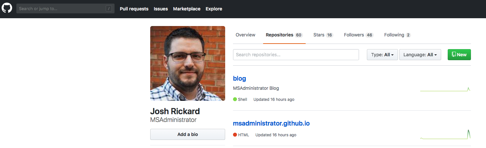

I recently transitioned my blog over to [GitHub Pages](https://pages.github.com) from [WordPress](https://wordpress.org).  I was using the free version from WordPress.org and I wanted more granular control over the layout.  Additionally, I wanted to automate my blog publishing and social media notifications; the free version of WordPress didn't meet my needs.  So I looked around and eventually fell in love with [Hugo](https://gohugo.io)!  This post outlines how to go about setting up a GitHub Pages website/blog using Hugo.

## GitHub

In order to host a website using GitHub Pages you need to first have a GitHub account. You will also need to create two new (empty) repositories.

```text
# The first repository
{your_github_account_name}.github.io

# The second repository
blog
```

### GitHub Pages Repository

In order for GitHub pages to be used you need to have a blank repository that is named `{your_github_account_name}.github.io`.  In my case, my GitHub account name is currently [MSAdministrator](https://github.com/MSAdministrator) so I have a repository named [`msadministrator.github.io`](https://github.com/MSAdministrator/msadministrator.github.io).  

> You can find your GitHub account name by looking at your base account profile page.  Your account will be https://github.com/{your_github_account_name}.

If I was to go to my repository in GitHub then I would visit [https://github.com/MSAdministrator/msadministrator.github.io](https://github.com/MSAdministrator/msadministrator.github.io).  You should have the same layout in your GitHub account.

This repository will actually contain our production or live website files.  We will configure this in a bit, but once we have everything setup then a visitor could visit https://{your_github_account_name}.github.io to view your GitHub Pages site.

### Raw Blog Content Repository

The second repository is called (in my case, but it can be whatever you want to call it) `blog`.  This repository will contain all the raw files and templates that are used by Hugo to generate your `public` facing GitHub Pages site.  I will explain this further, but just remember this is where the main "source" of your Hugo site is located and the first repository is where your actual site will exist.

You should now have two repositories setup similar to how mine look (but with your account name).



Now that you have your two empty repositories, let's go ahead and use Git (or you can download directly from GitHub) and clone the `blog` repository locally.

```git
cd ~\_GitHub\

git clone git@github.com:{your_github_account_name}/blog.git
```

## Hugo

Hugo is a framework for building static websites.  It utilizes templates and markdown to generate the content for your site.  This means, that you can write your blog posts completely in Markdown syntax and Hugo will generate HTML pages for your content.  Pretty cool huh?!

The main reason I choose Hugo was that I wanted to write my blogs in Markdown, plus I wanted to have a lot of granular control over all the aspects of my site.  Additionally, automation was key!

Let's go ahead and install Hugo.  You can install Hugo using `brew` by calling:

```bash
brew install hugo
```

Once you have `hugo` installed you can verify that it installed successfully by calling `hugo version`.  

After we have installed `hugo` then let's go ahead and create a new site.  Installing a new site is needed so that we can setup a few of the basic dependencies that we will use later.  

```bash
# cd into the folder that contains your two repositories you cloned earlier
cd ~\_GitHub\

# create a new site using hugo cli
# and place the new site files in your blog folder (second repository you cloned)
hugo new site blog
```

Next thing to do is find a hugo template that you like.  You can view a complete list of all the hugo themes by visiting [https://themes.gohugo.io](https://themes.gohugo.io).  For this example, we will use the `hello-friend` theme.  You can view the `Hello Friend` theme [here](https://themes.gohugo.io/hugo-theme-hello-friend/).

In regards to themes, you can have two separate approaches depending on your needs/wants.  You can create a Git `submodule` for your theme or you can just download your theme and place it in your `blog` repository.  

A `submodule` will be a reference to the original theme location in GitHub.  This means that any changes to the creator of the theme will automatically be used/referenced in your website generation.  This is great if you don't plan to make any changes to the theme template, but I like to make changes so I elect to just download the repository and place it manually in my `blog` repository.

To add the `hello-friend` theme as a `submodule` to your repository you would call:

```bash
# Inside your blog repository folder call the following git command
git submodule add https://github.com/panr/hugo-theme-hello-friend.git themes/hello-friend
```

To add the `hello-friend` theme as a independent (not a submodule) theme to your repository then you would call:

```bash
git clone https://github.com/panr/hugo-theme-hello-friend.git themes/hello-friend
```

Either of these approaches should create a folder with the name of your theme under the `themes` folder.  For example, you should now have `~/_GitHub/blog/themes/hello-friend` folder.

Our theme should have a default `config.toml` file that you can use (most do).  The `config.toml` file is a pure site wide configuration file that allows you to specify your base URL, turn settings on and off, etc.  Let's go ahead and copy our themes `config.toml` and default example content to our root `blog` repository.

```bash
# While in ~/_GitHub/blog repository folder we would run the following 
cp -r themes/hello-friend/exampleSite/* .
```

Each `config.toml` has different default values or settings, but you can also specify your own (we won't go into this in this blog post).  For the `hello-friend` theme the default `config.toml` that we copied looks like this:

```toml
baseurl = "https://example.org/"
languageCode = "en-us"
title = "Hello Friend"
theme = "hugo-theme-hello-friend"
copyright = ""
paginate = 5

[params]
  subtitle = "A simple theme for Hugo"

[menu]
  [[menu.main]]
    identifier = "about"
    name = "About"
    url = "/about"
  [[menu.main]]
    identifier = "showcase"
    name = "Showcase"
    url = "/showcase"
```

At a minimum, let's go ahead and set our `baseurl` to our new site address.  This will be `https://{your_github_account_name}.github.io`.  We will also change the `title` and a misconfiguration in this template specifically; the `theme value`.  So in my example, my `config.toml` would now look like this:

```toml
baseurl = "https://msadministrator.github.io/"
languageCode = "en-us"
title = "MSAdministrator Blog"
theme = "hello-friend"
copyright = ""
paginate = 5

[params]
  subtitle = "A simple theme for Hugo"

[menu]
  [[menu.main]]
    identifier = "about"
    name = "About"
    url = "/about"
  [[menu.main]]
    identifier = "showcase"
    name = "Showcase"
    url = "/showcase"
```

After we have modified our `config.toml` we will also clean up the default `archetypes` that we copied earlier.  To do this call the following from our `blog` repository root folder.  

> The reason we are cleaning up the archetypes it that the default processing order that hugo takes when generating content.  We want to use our themes archetypes and not the default ones in the hugo new site template we did earlier.

```bash
rm archetypes/default.md
```

Now that we have changed our default `config.toml` let's go ahead and tell `hugo` to generate a site.  We do this by calling `hugo` from our `blog` repository folder.  This will run and it should not return any errors.  If it was successful you should have a new folder called `public` in your `blog` repository.  In a bit, we will modify this `public` folder but for now let's test out our website.

```bash
# Let's run a local copy of our new generated site
hugo server
```

You should be told to visit `http://localhost:1313/` in your web browser.  Go ahead and do this and checkout your new Hugo generated website!  

After looking around, let's shutoff the hugo webserver by pressing `crtl+c` in your terminal.

Congratulations, you are now up and running with `Hugo`!

## Generate GitHub Pages site

So we have not yet touched the first repository we created, our `{your_github_account_name}.github.io` repository, but we will now.  The first thing to understand is that our `blog` repository contains the raw files that are used by `hugo`.  These files will generate (convert) our markdown and templates into a functioning website.  This is what is placed in our `public` folder.  Currently our public folder has some website files in, but let's go ahead and remove them now.  Don't worry, we will change this in a bit.

```bash
# Remove our public folder from your blog repository
rm -rf public
```

Now that our old `public` folder is removed, we are actually going to begin using our `{your_github_account_name}.github.io` repository.  But, we are going to make this repository a `submodule` of our `blog` repository.  

> A git submodule is typically used in cases when you have a third-party library or dependency within your root project.  In our case, a submodule will contain our generated GitHub Pages website files.

To do this, let's do the following:

```bash
# Run the following git command to make our {your_github_account_name}.github.io repository a submodule of our blog repository
# Make sure that you are in the blog folder
git submodule git@github.com:{your_github_account_name}/{your_github_account_name}.github.io.git public
```

This will clone your `{your_github_account_name}.github.io` repository into the `public` folder under your `blog` repository.  

Let's go ahead and generate our new GitHub Pages website!

```bash
hugo server
```

After running this command you should be able to see that there are now files in our `public` folder.  This is your new GitHub Pages site!!  Congrats!!!

After reviewing our site locally using the `hugo server` web server, we should stop the server and let's push some code to our repositories!

```git
# add our source files to GitHub
git add .
git commit -m 'pushing github pages source files to our repo'
git push

# Now we are going to add our generated github page site to it's repository
cd public/
git add .
git commit -m 'publishing my initial GitHub pages site'
git push
```

That's it!!!  You're a GitHub Pages having machine!  

After a few minutes, you should now be able to go to your GitHub Pages site by visiting https://{your_github_account_name}.github.io.  In my example, it would be this site that you are reading this article on now!  Pretty cool huh!?

## Bonus Automation

This is cool and all, but let's add a little `shell` script to automate some of this for us when we want to publish a new article.  Before we can automate, let's generate a new post.  Each template has it's own `content` types.  The `hello-friend` template uses a `post` content type.  To generate a new `post` let's go back to our terminal and run the following:

```bash
hugo new post/my-first-post-using-hugo-and-github-pages.md
```

This will create a new `markdown` file in the `content/post` folder under your `blog` repository.  Based on the themes `archetypes` it will generate a template markdown file based on the content type.  You can view these default `archetypes` for our theme under the `themes/hello-friend/archetypes/` folder.  This theme in particular only has the 1 template, but a lot of themes have multiple `archetypes`.

Your new post should have the following at the top of the page:

```text
---
title: "My First Post Using Hugo and Github Pages"
date: 2018-08-26T17:32:37-04:00
draft: true
---
```

Let's add some text to this new markdown file as an example.  Your markdown file should look like this.

```text
---
title: "My First Post Using Hugo and Github Pages"
date: 2018-08-26T17:32:37-04:00
draft: false
---
# Hello world!!!!

### Welcome to my new GitHub Pages blog

This site was generated using Hugo and is hosted using GitHub Pages.  I am hoping to spread my knowledge and expertise through this site in the coming days/weeks.
```

Now that we have saved this, let's add some automation in the mix before we proceed.  Let's create a `.sh` script to help with this:

```bash
#!/bin/bash

echo -e "\033[0;32mDeploying updates to GitHub...\033[0m"

# Build the project.
hugo # if using a theme, replace with `hugo -t <YOURTHEME>`

# Go To Public folder
cd public
# Add changes to git.
git add .

# Commit changes.
msg="rebuilding site `date`"
if [ $# -eq 1 ]
  then msg="$1"
fi
git commit -m "$msg"

# Push source and build repos.
git push origin master

# Come Back up to the Project Root
cd ..
```

After saving this new file as `deploy.sh` in our root `blog` directory, let's make it an executable:

```bash
chmod +x deploy.sh
```

Now, all we have to do is call `deploy.sh` to generate any new content from our markdown posts and push our code to our GitHub Pages repository.

```bash
cd ~/_GitHub/blog
./deploy.sh "adding my first blog post to GitHub pages"
```

> If you add any new markdown files then you should push your blog repository as well.

That's it!  In a few seconds (or a minute or so) you should see your new blog post on your GitHub Pages site!  Congratulations!!!!  If you have any questions, please do not hesitate to reach out to me on Twitter at [@MS_dministrator](https://twitter.com/MS_dministrator).