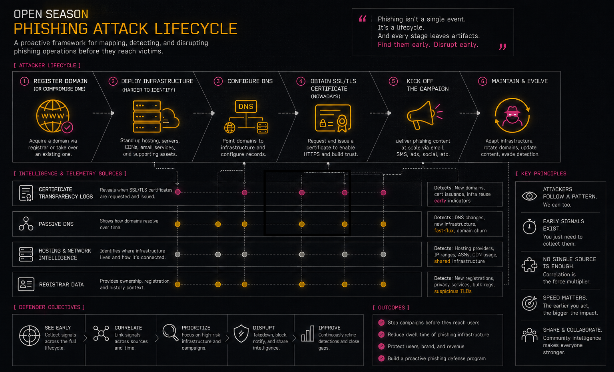

What up nerds? I was reading this awesome post from LP titled [Open Season: Certificate Transparency](https://dispatch.thorcollective.com/p/open-season-certificate-transparency) (I highly recommend you read this too) and it forced me to write this blog about a free and open (mostly) service which can add another layer of context / enrichment to your threat intelligence toolbelt.

Before I get into [CZDS](https://czds.icann.org/home), first I want to set the stage of how we can view this data along with the other sources (mentioned in LPs blog and many others).




When a threat actor, let’s call them BOB, is going to setup a phishing campaign they will typically: 

* Register a domain (or compromise one)
* Deploy their infrastructure (this one is more difficult to identify at this stage)
* Configure DNS
* (Nowadays) Obtain a SSL/TLS certificate
* Kick off the campaign 

There are also operational steps that are highly dependent on infrastructure:

* General reconnaissance
* Brand impersonation/cloning/etc.
* Testing and verification
* Lure infrastructure may be different

All of these are different sources of data.

The important thing to understand is that each phase leaves behind a different type of telemetry:

* Certificate Transparency logs tell us when certificates are issued.
* Passive DNS tells us how infrastructure resolves over time.
* Hosting and network intelligence tells us where infrastructure lives.
* Registrar data gives us ownership and registration context.

CZDS gives us visibility into one of the earliest events in this lifecycle: domain delegation.

Today, though, we are going to talk more about the first phase: domain registration.

DNS (Domain Name System) is a globally distributed, hierarchical naming system. The age-old question of how the internet works is how domain.com eventually resolves to an IP address. When a new domain is delegated, the appropriate TLD registry publishes that delegation, so recursive resolvers can eventually discover it.

Before a phishing page exists, before a certificate is issued, before a victim receives an email, there is usually a domain registration and DNS delegation event.

That small window is where CZDS becomes interesting.

Because of this, ICANN has a service called CZDS (Centralized Zone Data Service) which provides daily zone files for participating gTLD registries. These zone files map delegated domains to their authoritative name servers and, when necessary, include glue records containing the IP addresses of those name servers.

In other words, CZDS gives defenders a view into the DNS delegation layer of the internet.

It does not tell you what a domain is currently hosting, what IP address a website resolves to, or what content exists behind the domain. Instead, it tells you that a domain exists and where its authoritative DNS infrastructure lives.

By collecting this data over time, you can begin to see how certain authoritative name servers repeatedly appear alongside fuzzy domain registrations, how domain name re-use/re-registration occurs over extended periods of time, or view outliers/clusters in relation to your own threat intelligence feed.

## What is CZDS?

One reason CZDS tends to be overlooked is that the raw data isn’t immediately exciting. A zone file is just text, and most of the records you’ll encounter are completely benign.

Unlike Certificate Transparency, where suspicious certificate requests can sometimes stand out on their own, the value in CZDS rarely comes from an individual record. It emerges when you collect snapshots over time, enrich them with other datasets, and start asking relationship-based questions instead of record-based ones.

To use [CZDS](https://czds.icann.org/home) you do have to register an account and get an API key to download the compressed files. Each .zone file contains DNS delegation information for a gTLD, including delegated domains, authoritative name servers, and glue records where required.

I’m not going to go into details about name servers here, but the basics are that authoritative name servers publish the DNS records that allow resolvers to translate domain names into IP addresses and other resource records.

The IP addresses you see in a CZDS TLD zone file are glue records. They are not the IP addresses of the domain itself but rather the IP addresses of authoritative name servers when those addresses are needed to complete DNS delegation.

This distinction is important because CZDS is not passive DNS.

CZDS will not tell you:

* Where a domain currently resolves
* Historical A/AAAA resolutions
* HTTP behavior
* Malware delivery infrastructure
* Certificate history

For that, you still need additional data sources.

What CZDS does provide is the earliest DNS-level visibility into domain existence and delegation relationships.

There is an important tradeoff, though. Certificate Transparency can often provide visibility close to the moment a certificate is issued, whereas CZDS is distributed as periodic snapshots by participating registries. Rather than observing individual delegation events in real time, you’re observing how the delegation layer changes over time. Those are different datasets with different strengths, and together they provide a more complete picture of infrastructure evolution.

## Data Relationships

This is where the data becomes much more interesting.

A single domain registration by itself is usually just noise.

A domain that shares authoritative infrastructure with hundreds of other suspicious domains is a different story.

The value is not necessarily in the individual record. The value comes from the relationships.

Imagine ingesting daily zone files for a handful of popular gTLDs. One morning, a newly delegated domain catches your attention. On its own, it isn’t particularly interesting. But when you pivot to its authoritative name servers, you discover they’re also responsible for hundreds of other recently delegated domains.

Those name servers resolve through the same glue IPs, which belong to infrastructure you’ve previously associated with phishing activity. None of the domains have active websites yet, and none have appeared in Certificate Transparency logs. Nevertheless, you’ve already identified what appears to be a coordinated infrastructure cluster before most defenders would even know it exists.

That’s the advantage of treating CZDS as relationship data instead of a list of domain names. You’re not waiting for malicious content to appear; you’re looking for infrastructure patterns that suggest future activity.

For example:

```text
domain
  |
  +-- authoritative nameserver
          |
          +-- glue IP
                  |
                  +-- ASN
                  |
                  +-- other domains
```

Once you start looking at CZDS data as relationship data instead of just DNS records, you can begin building infrastructure graphs.

There are dozens of ways that this data can be useful for your organization:

* Shared authoritative name servers
* Shared glue IPs
* Newly delegated domains
* Registrar patterns (with additional data)
* DNS hosting providers
* Infrastructure reuse
* Identifying clusters of related registrations

The problem though is size because of exponential growth over time (which has limited my research) unless you engineer it.

> NOTE: If anyone has petabyte(s) storage for free and forever then holla at me

The interesting engineering problem is not necessarily storing every record forever. It is deciding what relationships and attributes actually matter.

For example, instead of storing:

```text
domain -> every historical DNS record
```

you may get more value from storing:

```text
nameserver -> domains
IP -> nameservers
ASN -> infrastructure
registrar -> domains
first_seen
last_seen
```

The intelligence questions you want to answer should drive the data model.

## Understanding CZDS Zone Files

Each .zone file contains DNS delegation information for a gTLD, including delegated domains, authoritative name servers, and glue records where required.

For example, a simplified delegation may look something like:

```text
example.com. 172800 IN NS ns1.example.net.
ns1.example.net. 172800 IN A 192.0.2.10
```

The first record tells resolvers which authoritative name server is responsible for the domain.

The second record exists because ns1.example.net is within the namespace being delegated, and the resolver needs the IP address to find that server.

This is why CZDS is useful, but also why it is commonly misunderstood.

These zone files will give you the authoritative information for a gTLD but not details about the domain itself (the domain’s A, AAAA, CNAME, MX, etc. records); that you must still do if needed/warranted/etc.

The intelligence comes from combining CZDS with other sources.

For example:

```text
CZDS
 |
 +-- Domain delegation
        |
        +-- Nameserver
              |
              +-- Glue IP
                    |
                    +-- ASN
                    |
                    +-- Other observed domains
```

That relationship can then be enriched with:

* Certificate Transparency
* WHOIS/RDAP
* Passive DNS
* Hosting intelligence
* Reputation feeds
* Internal telemetry

The goal is not to answer:

```text
“Is this domain malicious?”
```

The goal is to answer: 

```text
“What infrastructure relationships does this domain have, and have we seen similar behavior before?”
```

## Parsing Zone Files

Here’s a general layout of the field data in these zone files: 

```text
www.example.com. 3600 IN A 192.168.1.10
```

which produces the following in a JSON format:

```json
{
    "dns_record": "www.example.com",
    "ttl": "3600",
    "record_class": "IN",
    "record_type": "A",
    "record_data": "192.168.1.10"
}
```

For CZDS specifically, the records you will most commonly care about are delegation-related records:
 
* NS records
* Glue A records
* Glue AAAA records

The challenge with CZDS is not parsing a single file.

The challenge is scale.

Zone files can be large, and storing every record from every zone forever, quickly becomes impractical unless you have a very specific reason for doing so. 

This is why streaming is important.

Instead of:

```python
records = load_entire_zone_file() 
```

you generally want:

```python
for record in stream_zone_file(): 

    process(record) 
```

This allows you to:

* Process large zones with constant memory usage
* Build enrichment indexes incrementally
* Extract only relationships you care about
* Avoid loading multi-gigabyte files into memory

## Implementation Examples

I have had a few implementations of using CZDS over the years. The most recent is embedded as a source within a project called go-member-extender. This takes a MMDB database (binary search tree over IP addresses; fast lookups possible) and can extend or upsert it with data from different sources.

This one happens to be CZDS and written in Golang: 

https://github.com/MSAdministrator/go-mmdb-extender/blob/main/internal/source/czds/czds.go

The general idea is:

```text
CZDS Zone File 
        | 
        v 
Parse delegation data
        |
        v
Extract relationships
        |
        v
Enrich IP intelligence database
```

The advantage of this approach is that you can combine CZDS-derived information with other enrichment sources without needing to query massive raw datasets during investigations.

If Python is more your thing, then check out my Python package/CLI tool for CZDS below.

This one doesn’t touch a MMDB at all and just retrieves the zone files as requested.

https://github.com/MSAdministrator/czds

With either tool, remember you must have API access and have been granted access to more than one zone files.

## Python Streaming Parser (example)

The first implementation uses dnspython and provides behavior similar to Go’s DNS parsing libraries.

The goal is:

* Stream records
* Avoid loading entire zones
* Support compressed zone files
* Process records as they arrive

```python
from __future__ import annotations

import gzip
from pathlib import Path
from typing import Iterator

import dns.exception
import dns.name
import dns.rdata
import dns.rdataclass
import dns.rdatatype
import dns.tokenizer
import dns.zonefile


def stream_zone_records(
    filename: str | Path,
    origin: str,
) -> Iterator[dns.rdata.Rdata]:
    """
    Stream records from a zone file without loading the entire zone.

    Yields ResourceRecord objects one at a time, similar to Go's
    dns.NewZoneParser().
    """
    opener = gzip.open if str(filename).endswith(".gz") else open

    with opener(filename, "rt", encoding="utf-8", errors="replace") as f:
        tok = dns.tokenizer.Tokenizer(f)

        reader = dns.zonefile.Reader(
            tok,
            dns.name.from_text(origin),
            rdclass=dns.rdataclass.IN,
            relativize=False,
        )

        while True:
            try:
                rr = reader.read_rr()
            except EOFError:
                break
            except dns.exception.DNSException as e:
                raise RuntimeError(f"Zone parse error: {e}") from e

            if rr is None:
                continue

            yield rr
```

The important part here is not the dictionary itself. The important part is that we are transforming raw DNS data into relationships that can later be queried.

A raw zone file is just text. 

A relationship database built from those records becomes intelligence.

## Lightweight CZDS Parser

The second implementation is a lightweight parser written specifically around the CZDS workflow. 

The goal was not to replace full DNS parsing libraries.

The goal was a small streaming parser that handles the features needed for large-scale zone processing:

* Streaming iteration (for rr in ZoneParser(path):)
* Constant memory usage
* .gz and plain text support
* $ORIGIN
* $TTL
* Owner inheritance
* Multiline records with parentheses
* Comment stripping
* Quoted-string preservation
* RFC 3597 TYPE#### support
* Lightweight ResourceRecord dataclass

This version is intentionally focused on CZDS-style processing rather than being a complete replacement for every possible BIND zone feature. 

> NOTE: This bottom one was written by Claude so take it with a grain of salt but it looks like to would work.

```python
from __future__ import annotations

from dataclasses import dataclass
from pathlib import Path
import gzip
import re
import shlex
from typing import Iterator, TextIO

RFC3597_TYPE = re.compile(r"^TYPE\d+$", re.IGNORECASE)
_CLASSES = {"IN", "CH", "HS"}


@dataclass(slots=True)
class ResourceRecord:
    name: str
    ttl: int | None
    rdclass: str
    rdtype: str
    rdata: tuple[str, ...]


class ZoneParser:
    """Streaming BIND zone parser suitable for CZDS."""

    def __init__(self, path: str | Path):
        self.path = Path(path)
        self.origin = ""
        self.default_ttl: int | None = None
        self.current_owner: str | None = None

    def __iter__(self) -> Iterator[ResourceRecord]:
        opener = gzip.open if self.path.suffix == ".gz" else open
        with opener(self.path, "rt", encoding="utf-8", errors="replace") as f:
            yield from self._parse(f)

    @staticmethod
    def _strip_comment(line: str) -> str:
        out = []
        quoted = False
        escaped = False
        for ch in line:
            if escaped:
                out.append(ch)
                escaped = False
                continue
            if ch == "\\":
                escaped = True
                out.append(ch)
                continue
            if ch == '"':
                quoted = not quoted
                out.append(ch)
                continue
            if ch == ";" and not quoted:
                break
            out.append(ch)
        return "".join(out)

    def _fqdn(self, owner: str) -> str:
        if owner == "@":
            return self.origin
        if owner.endswith("."):
            return owner[:-1]
        return f"{owner}.{self.origin}" if self.origin else owner

    def _parse(self, fh: TextIO) -> Iterator[ResourceRecord]:
        buf = []
        depth = 0
        for raw in fh:
            line = self._strip_comment(raw).strip()
            if not line:
                continue
            depth += line.count("(")
            depth -= line.count(")")
            buf.append(line.replace("(", " ").replace(")", " "))
            if depth > 0:
                continue
            record = " ".join(buf)
            buf.clear()

            if record.startswith("$ORIGIN"):
                parts = record.split(None, 1)
                if len(parts) > 1:
                    self.origin = parts[1].rstrip(".")
                continue
            if record.startswith("$TTL"):
                parts = record.split(None, 1)
                if len(parts) > 1:
                    self.default_ttl = int(parts[1])
                continue

            lex = shlex.shlex(record, posix=True)
            lex.whitespace_split = True
            tokens = list(lex)
            if not tokens:
                continue

            idx = 0
            owner = None
            first = tokens[0]
            up = first.upper()
            if not first.isdigit() and up not in _CLASSES:
                owner = first
                self.current_owner = owner
                idx = 1
            else:
                owner = self.current_owner
                if owner is None:
                    continue

            ttl = None
            rdclass = "IN"

            while idx < len(tokens):
                t = tokens[idx]
                u = t.upper()
                if t.isdigit():
                    ttl = int(t)
                    idx += 1
                elif u in _CLASSES:
                    rdclass = u
                    idx += 1
                else:
                    break

            ttl = self.default_ttl if ttl is None else ttl
            if idx >= len(tokens):
                continue

            rdtype = tokens[idx].upper()
            idx += 1

            if not (rdtype.isalpha() or RFC3597_TYPE.fullmatch(rdtype)):
                continue

            yield ResourceRecord(
                name=self._fqdn(owner),
                ttl=ttl,
                rdclass=rdclass,
                rdtype=rdtype,
                rdata=tuple(tokens[idx:]),
            )


if __name__ == "__main__":
    import sys
    for rr in ZoneParser(sys.argv[1]):
        print(rr)
```

Like Certificate Transparency, CZDS isn’t valuable because it magically identifies malicious domains. Its value comes from exposing another layer of attacker infrastructure that would otherwise remain difficult to observe.

By itself, a zone file is little more than a collection of DNS delegation records. Combined with Certificate Transparency, Passive DNS, registrar information, hosting intelligence, and your own internal telemetry, those records become edges in an infrastructure graph that can reveal relationships long before a phishing campaign reaches a victim. 

That’s ultimately the lesson I took away after reading LP’s post. Modern threat intelligence isn’t about finding one perfect dataset, it’s more about understanding what each dataset can tell you, what it can’t, and how combining them creates something far more valuable than any individual source alone.
