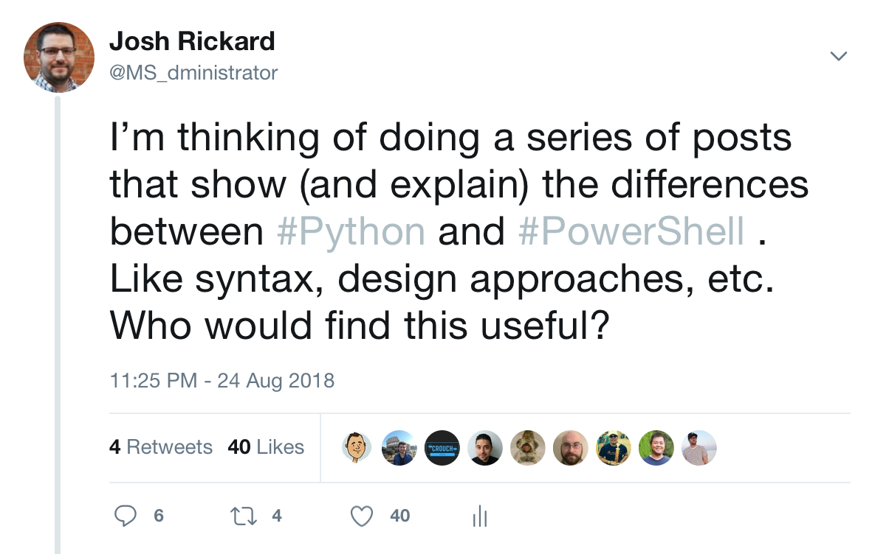

I posted a tweet earlier this week asking if anyone would be interested in a small series of posts that explain the differences between Python and PowerShell.  



So, here we go!

## Python on macOS

Python and PowerShell are quite a bit different from each other.  Python has been around for several years and works on multiple operating systems.  Additionally, Python is beloved by it's extremely supportive open-source community; rightfully so!  Python is fast and portable, and is a go to for most developers.  

At the time of writing this post, there are two distinct release branches.  These are Python 2.x and 3.x.  **This entire blog series will focus only on Python 3.x.**  The current version of [Python is 3.7.0 for macOS(https://www.python.org/downloads/)], but luckily if you have a modern OS X system Python is already installed by Apple.  Even though it is installed by default on Mac OS X, we should make sure that we have the latest version installed.

The first step if you are on a Mac OS X system is to open up your Terminal app and run the following command.  

Please note, that if you are on a Windows system then you will need to download Python 3.x from [here](https://www.python.org/downloads/windows/). Additionally, [here is a great article that walks through installing Python on Windows](https://www.howtogeek.com/197947/how-to-install-python-on-windows/).  Once you have installed Python then these commands should work the same whether on Mac OS X or Windows.

```python
# Try both python and python3 if you have two seperate branches of Python installed
python -V
# or
python3 -V
```

This will output the current version of Python installed on your system.  If it is not Python 3.x, then you will need to install it using your choice of package manager or straight from the [https://pythong.org](https://python.org) website.  

If you use `brew` as your package manager, then you can simply install `python3` by calling:

```bash
brew install python3
```

While we have our Terminal app open, let's also check to make sure that we have the latest version of `pip` installed.  [Pip](https://pip.readthedocs.io/en/stable/installing/) is Python's package manager.  This is how Python installs additional libraries or `requirements` needed to work with a library or package.  Let's check to make sure that we have pip installed and it is running.

Please note, that if you are installing Python on Windows then `pip` is installed by default.  Either way, it is still good to check which pip commands works for your system.

```python
# The same with Python, you can have two versions of pip intalled
pip -V
# or
pip3 -V
```

## PowerShell on Windows

PowerShell is natively installed on Windows machines since Windows 7 (give or take).  As new features are released by the PowerShell Team, you can upgrade your version of PowerShell as well.  But, this has potential drawbacks as PowerShell has different version functionality depending on your operating system.  For example, PowerShell 5.0 is more full featured on a Windows 10 operating system than it is on a Windows 7 operating system.  Most of the features are present, but there are differences.  

You can upgrade PowerShell on any Windows 7 or higher system, but to do this you will need to install a new version of the Windows Management Framework (WMF) (sometimes multiple versions) to upgrade.  Before we do that, you can find out the specific version you are on by opening up a PowerShell console and running:

```powershell
$PSVersionTable
```

This should output your version of PowerShell.  If you are on a brand-new Windows 7 machine, then you will be on PowerShell 2.  To upgrade you will need to first install WMF 3.0, then you can install WMF 5.0 (skipping WMF 4.0).  

I have compiled a json file that has all the download links for all the versions of WMF that you can install:

```json
{
   "WMF3": {
      "Win7": {
        "x86": "https://download.microsoft.com/download/E/7/6/E76850B8-DA6E-4FF5-8CCE-A24FC513FD16/Windows6.1-KB2506143-x86.msu",
        "x64": "https://download.microsoft.com/download/E/7/6/E76850B8-DA6E-4FF5-8CCE-A24FC513FD16/Windows6.1-KB2506143-x64.msu"
      }
   },
   "DotNet4": "https://download.microsoft.com/download/1/B/E/1BE39E79-7E39-46A3-96FF-047F95396215/dotNetFx40_Full_setup.exe",
   "WMF4": {
      "Win7": {
        "x64": "https://download.microsoft.com/download/3/D/6/3D61D262-8549-4769-A660-230B67E15B25/Windows6.1-KB2819745-x64-MultiPkg.msu",
        "x86": "https://download.microsoft.com/download/3/D/6/3D61D262-8549-4769-A660-230B67E15B25/Windows6.1-KB2819745-x86-MultiPkg.msu"
      },
      "Server2012": "https://download.microsoft.com/download/3/D/6/3D61D262-8549-4769-A660-230B67E15B25/Windows8-RT-KB2799888-x64.msu"
   },
   "WMF5": {
      "Server2008R2": "https://download.microsoft.com/download/2/C/6/2C6E1B4A-EBE5-48A6-B225-2D2058A9CEFB/Win7AndW2K8R2-KB3134760-x64.msu",
      "Server2012": "https://download.microsoft.com/download/2/C/6/2C6E1B4A-EBE5-48A6-B225-2D2058A9CEFB/W2K12-KB3134759-x64.msu",
      "Server2012R2": "https://download.microsoft.com/download/2/C/6/2C6E1B4A-EBE5-48A6-B225-2D2058A9CEFB/Win8.1AndW2K12R2-KB3134758-x64.msu",
      "Win7": {
         "x64": "https://download.microsoft.com/download/2/C/6/2C6E1B4A-EBE5-48A6-B225-2D2058A9CEFB/Win7AndW2K8R2-KB3134760-x64.msu",
         "x86": "https://download.microsoft.com/download/2/C/6/2C6E1B4A-EBE5-48A6-B225-2D2058A9CEFB/Win7-KB3134760-x86.msu"
      },
      "Win81": {
         "x64": "https://download.microsoft.com/download/2/C/6/2C6E1B4A-EBE5-48A6-B225-2D2058A9CEFB/Win8.1AndW2K12R2-KB3134758-x64.msu",
         "x86": "https://download.microsoft.com/download/2/C/6/2C6E1B4A-EBE5-48A6-B225-2D2058A9CEFB/Win8.1-KB3134758-x86.msu"
      }
   },
   "WMF51": {
      "Server2012": "https://download.microsoft.com/download/6/F/5/6F5FF66C-6775-42B0-86C4-47D41F2DA187/W2K12-KB3191565-x64.msu",
      "Server2012R2": "https://download.microsoft.com/download/6/F/5/6F5FF66C-6775-42B0-86C4-47D41F2DA187/Win8.1AndW2K12R2-KB3191564-x64.msu",
      "Win81": {
         "x64": "https://download.microsoft.com/download/6/F/5/6F5FF66C-6775-42B0-86C4-47D41F2DA187/Win8.1AndW2K12R2-KB3191564-x64.msu",
         "x86": "https://download.microsoft.com/download/6/F/5/6F5FF66C-6775-42B0-86C4-47D41F2DA187/Win8.1-KB3191564-x86.msu"
      }
   }
}
```

Once you have installed or upgraded to atleast PowerShell 5.0, then you can again check to ensure that your `$PSVersionTable` environmental variable states 5 or higher.

## PowerShell Core on macOS

Since the release of PowerShell Core, you can have the power of PowerShell on your macOS (or linux) systems.  To install PowerShell Core on a macOS system, you can use `brew` to install PowerShell Core:

```bash
# first make sure that brew is updated
brew tap
brew update

# next install PowerShell Core
brew cask install powershell
```

Once PowerShell Core is installed, you would typically think that you would access it by running `powershell` in our terminal, but it is actually `pwsh` in PowerShell Core.

Microsoft decided to change the name of the PowerShell CLI application to `pwsh` over the traditional `powershell.exe` for cross platform compatibility (among other reasons).  To see if PowerShell Core is working correctly, you should open your terminal application and launch powershell:

```bash
# run PowerShell Core as normal user
pwsh

# run PowerShell Core as a sudo user
sudo pwsh
```

Once you are in a PowerShell session you can identify the version of your current PowerShell Core install by using the same environmental variable:

```powershell
$PSVersionTable
```

```output
Name                       Value                                  
----                       -----                               
PSVersion                  6.0.2                              
PSEdition                  Core                            
GitCommitId                v6.0.2                         
OS                         Darwin 17.7.0 Darwin Kernel Version
Platform                   Unix                                       
PSCompatibleVersions       {1.0, 2.0, 3.0, 4.0...}                    
PSRemotingProtocolVersion  2.3                                        
SerializationVersion       1.1.0.1                                    
WSManStackVersion          3.0                                        
```

If a new version of PowerShell Core is released, you can use brew to upgrade your current version of PowerShell:

```bash
brew update
brew cask upgrade powershell
```

If you do not have or use `brew` you can also install PowerShell Core directly from the PowerShell GitHub repository.  These are located on the [Releases](https://github.com/PowerShell/PowerShell/releases/latest) page.

You download the version of PowerShell Core you want, but please make sure that you download the `pkg` of the selected version of PowerShell Core.

You can double click the `pkg` and follow the on-screen instructions or you can run the following via terminal:

```bash
sudo installer -pkg powershell-6.0.2-osx.10.12-x64.pkg -target /
```

That's it!  I hope you enjoyed the first part of this series explaining the differences between `PowerShell` and `Python` for beginners.