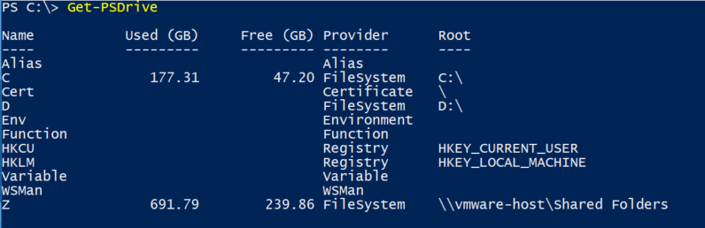

Windows Certificate Store is typically accessed using the MMC Snap-In,  You can view both the Computer or User certificate stores using a traditional MMC console.  Sometimes though, you may just want to programmatically access it using PowerShell.  Luckily you can do this using a PSDrive that is created on your machine.



As you can see there is a `Cert` drive and you can access it using PowerShell's multiple location based Cmdlets.  For example, if you can use `cd Cert:\` and it will change your current directory to the certificate PSDrive.  You can also use `Set-Location`,`Push-Location`, `Pop-Location` etc. when access your PSDrives.  

Once you have changed your directory to `PS Cert:\>` you can use your normal tools like `ls` or `dir` to identify what is in your certificate stores.  

```powershell
cd Cert:\
ls
# View your current local user certificate store
cd .\\CurrentUser\My\

# View your current local machine certificate store
cd .\\LocalMachine\My\
```

Using PowerShell you can access all your certificates and the certificate store using PowerShell.  