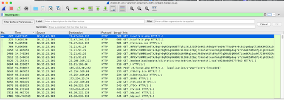
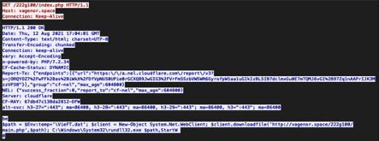
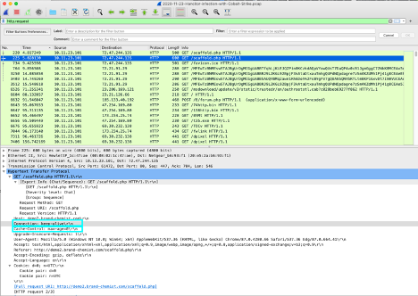
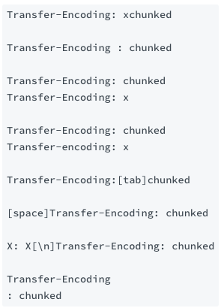
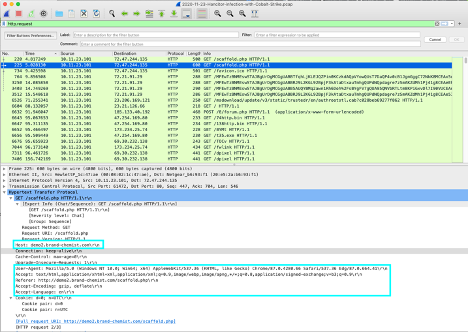
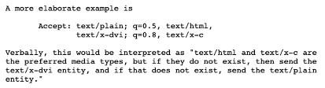
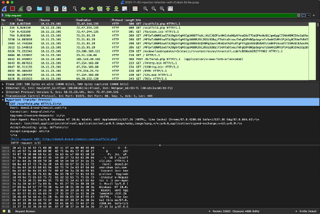
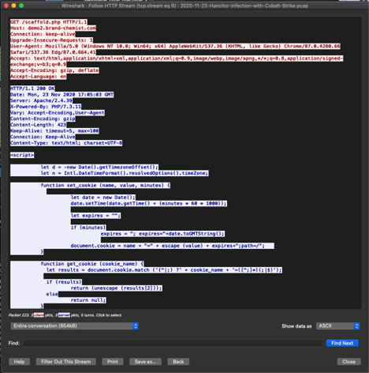
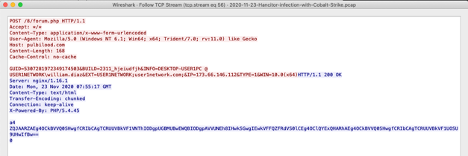
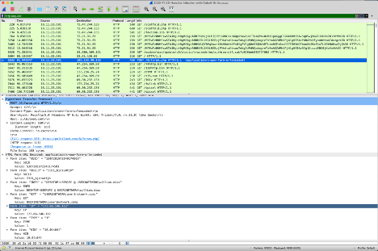

# Table of Contents

* [Summary](#summary)
* [Introduction](#introduction)
    * [Setup](#setup)
* [General Headers](#general-headers)
    * [Cache-Control](#cache-control)
    * [Connection](#connection)
    * [Transfer-Encoding](#transfer-encoding)
* [Request Headers](#request-headers)
    * [Common Request Headers](#common-request-headers)
    * [Accept](#accept)
    * [Accept-Encoding](#accept-encoding)
    * [Authorization](#authorization)
    * [User-Agent](#user-agent)
* [Response Headers](#response-headers)
    * [Common Response Headers](#common-response-headers)
    * [Location](#location)
    * [Vary](#vary)
    * [Server](#server)
    * [WWW-Authenticate](#www-authenticate)
* [Metadata Headers](#metadata-headers)
    * [Common Metadata Headers](#common-metadata-headers)
    * [Allow](#allow)
    * [Content-Encoding](#content-encoding)
    * [Content-Type](#content-type)
* [Conclusion](#conclusion)

# Summary

Networking is complex. Whether you are troubleshooting network connectivity or attempting to detect malicious external network communications, understanding the nuances of common HTTP requests is extremely helpful but often it can be difficult for many security and IT professionals.

When interacting with APIs or any internet connected service most people use a client library like Python’s `urllib` or `requests` which offer convenience and handle many of the nuances of communicating with an HTTP service for you. Under the hood, these libraries are following defined RFC’s (Request for Comment) for communication with a service, like an API. In every HTTP request, headers are sent along with the request being made. Whether that is a GET, POST, PUT, etc request to a specific endpoint or url, HTTP headers are also sent with both the requests and the server response.

These headers explain to the receiver of any request the constraints, options, and standards implemented by the service so they can properly communicate with it. Authentication, encoding, format, language, and many other properties are defined in these headers. Understanding these headers from an analyst perspective can help with investigating, responding, and defending against malicious network attacks.

## Understanding these nuances helps:

1. Security professionals identify malicious communications and improve detection capabilities
2. Developers to troubleshoot and debug code communicating with APIs and external services
3. IT Professionals when troubleshooting network connectivity or other software issues

# Introduction

HTTP (Hypertext Transfer Protocol) is a form of network communications between two or more systems which relays data over a physical medium. HTTP requests are sent and received during the entire transmission of action or data.

These requests have components that are used during each phase of the communication; method, headers, and body.

This e-book will discuss HTTP headers in depth as well as how you can leverage this information to defend against malicious behavior.

## Setup

We will be using several different examples of malware such as Emotet (Trickbot), Dridex, Hancitor with Cobalt Strike and others.

In order to follow along, you will need Wireshark installed as well as access to a browser. You can download Wireshark here: [https://www.wireshark.org/](https://www.wireshark.org/)

We will be using PCAPs (Packet Capture format) provided by [https://www.malware-traffic-analysis.net](https://www.malware-traffic-analysis.net).

> Important: Any samples you download should be used with caution - remember some of the files here are malicious. Once you have downloaded the files you can unzip them and use the password infected when prompted.

Additionally, when a sample PCAP is used we will provide a link to its respective sample. 

Once you have downloaded and installed Wireshark, we will open up a linked sample from [https://www.malware-traffic-analysis.net](https://www.malware-traffic-analysis.net). When opening a sample PCAP file you can filter by HTTP requests by entering the following as the filter input in the Wireshark filter toolbar:

	http.request

|  |
|:--:|
| <b>A screenshot of Wireshark and the Hancitor Infection with Cobalt Strike sample filtered by http.request</b>|

Let's begin.

# General Headers

In any HTTP request, there are general headers that are utilized within the request which gives the requestor (and the subsequent response) more control over the communication. These headers tell the other party within a communication if they are going to cache data, keep a connection alive or not, and/or the data format being used when transferring data. 

We call these general headers as in they can be used for any request and response between a client and server. 

In this section, we will go through a few of the common general headers in an HTTP request. These are Cache-Control, Connection, and Transfer-Encoding.

## Cache-Control

The Cache-Control header allows the user to specify whether data provided by a response to an HTTP request should be cached on the local system along with how that response is stored for future requests. There are several options available based on [RFC7234](https://datatracker.ietf.org/doc/html/rfc7234), but many libraries will set this to either private or a max-age of 0 by default. This default works in most cases but you can control this behavior in a more granular way.

Below is a table outlining the (common) different Cache-Control values and a brief definition:

|Value|Description|
|-----|-----------|
|Public|This means that the response may be cached by any server within the HTTP request being made|
|Private|This means that the response is intended for a single user and should be cached for other (processes) to access|
|no-cache|The means the response will not be used for any subsequent HTTP request (even for redirects)|
|no-store|This means that no part of the request or response should be stored. This is used if information is sensitive in nature.|
|no-transform|This means that any part of the request will not be transformed. Example, if you send an image and a proxy/cache service tries to convert an image to another type. With no-transform this will not happen.|
|max-age={value in seconds}|This is the max-age that any cache should be considered valued before being re-evaluated by the client or server.|

Understanding how Cache-Control works may not give you lots of information during an investigation unless you are investigating a web proxy. If that is the case then Cache-Control can give you lots of information from cached website pages to authentication information and more.

With cache-control, an ETag can be used to validate that the cached item matches what was expected. This is a hash generated by the server and can be used for comparison purposes. If the ETag is different then the request will retrieve a newly cached version of the entity. 

An ETag is used in many situations but most commonly used when retrieving and updating a resource. As mentioned before, an ETag is a hash of a resource and can be used to verify a request is updating the correct resource or if the resource itself has been modified by another process.

## Connection

The Connection header allows the sender to tell the server what is going to happen after this request/response is completed. There are a few options like keep-alive and close. 

Keep-alive is telling the server that this connection will continue and to prepare for that but this does not apply to proxies. When specifying Connection headers, proxies should not be relaying this information to further communications. This means that in turn proxies should be closing every connection.

The second Connection option is close. Close means I am done with this connection. Of course, other connections will and likely occur. Close simply means that for this request and response we are closing the connection.

Long running processes or transferring of large amounts of data (usually chunked) like files will often use the Connection: Keep-Alive header to indicate to the server that the connection is going to continue until we are done uploading/transferring said data.

Some malware will send an HTTP request to download additional files (tools) from a Command and Control server (C&C). As an example, you can see this being used by the [Lazarus](https://blogs.jpcert.or.jp/en/2020/08/Lazarus-malware.html) group as reported by the JPCERT. 

You can also see the use of Connection: Keep-Alive in below example of a Bazarloader using Cobalt Strike:

|  |
|:--:|
| <b>The initial request which returns code that downloads additional tools. This is an example of BazarLoader using Cobalt Strike: [https://www.malware-traffic-analysis.net/2021/08/12/index.html](https://www.malware-traffic-analysis.net/2021/08/12/index.html) </b>|

Additionally, Keep-Alive may be used when exfiltrating data as well since likely they are transferring large amounts of data which means their typical connection must be kept alive for a longer period of time.

|  |
|:--:|
| <b>Example of a Hancitor infection with Cobalt Strike showing the Connection and Cache-Control headers in the request</b>|

An example of these general headers can be seen in this sample of a [Hancitor infection with Cobalt Strike](https://www.malware-traffic-analysis.net/2020/11/23/index.html) PCAP from [malware-traffic-analysis.net](https://www.malware-traffic-analysis.net/2020/12/29/index.html).

## Transfer-Encoding

Transfer-Encoding is a hop-by-hop HTTP request header that explains what, if any, transformation of the request was done on that hop. Each type of transform must be added in the order of precedence. For example, it is very common to see that a transform was done using “chunked”. Chunked is used to split large amounts of dynamic content into multiple packets since the full size will not be known until the end of the transfer. If other transformations were done then you will also see the transfer-extension property. Unless absolutely necessary you probably will never mess with transfer-encoding headers but they are common to see.

When investigating HTTP requests remember that this header (as well as some others) can be obfuscated by modifying the format of the header itself. 

|  |
|:--:|
| <b>An example of some ways the Transfer-Encoding header can be obfuscated. Thanks to [https://book.hacktricks.xyz/pentesting-web/http-request-smuggling#te-te-vulnerabilities](https://book.hacktricks.xyz/pentesting-web/http-request-smuggling#te-te-vulnerabilities)</b>|

You will often see Transfer-Encoding as chunked but one good indicator is the combination of Content-Length (we will talk more about this later) being different then the actual length plus having Transfer-Encoding as chunked.

Please note that Content-Length is in bytes and that the length of the actual content is defined as the beginning of the body to the end. The end is defined as 2 bytes of data which are /r/n.

# Request Headers

In this section we will talk about request headers. These headers within an HTTP request allow the client to specify other details with the request being made. These details include encoding, authorization (authentication), proxy, referrer and more. By understanding the nuances of these headers, you will be able to create robust detection rules as well as troubleshoot problems easier.

## Common Request Headers

The most common values in request headers are Accept-Encoding, Authorization, and User-Agent. There are several other common values as seen in the table below, but we will only go into detail about the three most common values mentioned above.

> Commonality Scale
> * LOW - This equates to not seen very often in traditional requests
> * MED - This equates to not being obscure but is not extremely common to see in the wild.
> * HIGH - This equates to being commonly seen in requests.

|Value|Description|Commonality|
|-----|-----------|-----------|
|Accept|The Accept header and Accept-Encoding header are similar. Both are used to specify the media type in the request and response.|HIGH|
|Accept-Encoding|The Accept header and Accept-Encoding header are similar. Both are used to specify the media type in the request and response.|HIGH|
|Accept-Language|The Accept-Language header defines the accepted language for a response. This is not obscure by any means but it’s not very common to see.|MED|
|Authorization|This header is the most common and is used for authentication. Examples that are common are Basic, Digest, and Bearer (some value).|HIGH|
|Host|This value will contain the host and port number of the resource being requested, which is usually derived from the original request URL by client libraries.|HIGH|
|Max-Forwards|This value limits how many times a request can be forwarded through proxies, gateways, or other services.|MED to LOW|
|Proxy-Authorization|As the field suggests, you can provide this value to authenticate through a proxy. Similar to the Authorization header but it can have a set of different credentials for proxy authentication.|MED|
|Referer (yes it’s misspelled)|This header value allows the client to specify the URI of the resource being requested. This is mostly to benefit the server when making a request.|HIGH|
|User-Agent|This is probably the most common one to see. This is a string that represents what client you are making this request as.|HIGH|

Here is an example, using the same sample request from the [Hancitor PCAP](https://www.malware-traffic-analysis.net/2020/11/23/index.html) above. You can see that Accept, Accept-Encoding, Accept-Language, Host, Referrer and User-Agent are all defined.

|  |
|:--:|
| <b>Example of a Hancitor with Cobalt Strike PCAP and its response headers. Notice the Accept-Language header is set. This is not obscure, but it is also not extremely common either. [https://www.malware-traffic-analysis.net/2020/11/23/index.html](https://www.malware-traffic-analysis.net/2020/11/23/index.html)</b>|

## Accept

The Accept header tells the server what type of content encoding is accepted in the response. Often you find this to be */* but instead of strictly saying “any” encoding is accepted you should specify a specific type like application/json.

The Accept header is similar to the Accept-Encoding header (below) but the main difference is that the Accept header specifies the type as a MIME type.

If the Accept header is specified then the sender can also specify “accept-params” and “accept-extension”.  You will often not see these but they can be specified. If the Accept header is not present then it is assumed that the sender will accept all media types. 

If you see a q=0.5 or something similar in this field then it means that a certain quality (½) was specified if available. In other words, this q value is a weight provided by the requester in order of preference.

|  |
|:--:|
| <b>Above is an example provided within [RFC7232](https://datatracker.ietf.org/doc/html/rfc7231#page-38)</b>|

## Accept-Encoding

The Accept-Encoding header is used to restrict the content encoding of the response from the server. Many client libraries set this value to * but if you know that the response is a zipped/compressed file then you would likely set this to “compress, gzip”.  This would look like the following:

Accept-Encoding: compress, gzip

The Accept-Encoding header typically specifies the algorithm that the client will accept. IANA maintains a list of “official” encodings [here](https://www.iana.org/assignments/http-parameters/http-parameters.xml#http-parameters-1). There are additional encodings that are not part of the “official” list but are commonly used. You can find a list of these unofficial content encodings [here](https://en.wikipedia.org/wiki/HTTP_compression).

Here is a list of all “official” and unofficial encodings borrowed from the links above for your convenience:

* Official
    * aes128gcm
    * br
    * compress
    * deflate
    * exi
    * gzip
    * identity
    * pack200-gzip
    * x-compress
    * x-gzip
    * Zstd
* Unofficial
    * bzip2
    * izma
    * peerdist
    * rsync
    * xpress
    * xz

When investigating the transfer of malicious files you may come across a value for Accept-Encoding that is not on either of the lists above. This should be an indicator that something strange is going on and you should investigate further. 

If you do see a value on this but it is repeated (twice) then you should also investigate. Note that there are legitimate reasons to do this but it is uncommon. An example of this is:

	Accept-Encoding: deflate, deflate

Just like with the Accept header, you may also see a q (weight) value within this header.  It may look similar to the following:

	Accept-Encoding: gzip;q=0.2, *;q=0.5

## Authorization

The Authorization header is used when you need to specify some sort of authentication to the server. There are many different types of authentication like Basic, Digest, Bearer, etc. but the basics of the Authorization header is that it is used to authenticate and verify you are authorized to request what you are wanting to request.

The Authorization header key is simply Authorization but the value will differ based on the type of authorization specified by the service provider (API). The value of this header will start with the type of authentication being used (e.g. Basic, Digest, Bearer, etc.). This is followed by a single space and the encoded value that the server will then decode the value to verify you can access the requested resource. 

> SOAP BOX: When using the Authorization header you should always choose the most secure method possible. The value, ideally, should be encrypted and then encoded (base64) which in turn gets decoded and then decrypted by the server.

Below are examples of this type of authorization:

|  |
|:--:|
| <b></b>|

Each of these different types of authorization headers calculate their values differently or are provided when making the original request. To sum it up, it all depends on the API you are working with but it should have good documentation on how to authenticate and use the API.

You can find a maintained list (IANA) of authentication schemas [here](https://www.iana.org/assignments/http-authschemes/http-authschemes.xhtml) but for convenience I will list them below:

* Basic
* Bearer
* Digest
* HOBA
* Mutual
* Negotiate
* OAuth
* SCRAM-SHA-1
* SCRAM-SHA-256
* vapid

When investigating an HTTP request which contains an Authorization header you should always first try and decode the value string (typically this is Base64). Within macOS terminal you can run the following to decode this value:

    echo “your value here” | base64 --decode
	# or
	base64 --decode “/tmp/path/to/file/containing/string.txt”

After decoding this value you should be able to see if the value is encoded with another type of encoding or it is encrypted. If encrypted then you will have to find another way but it may just be plain text or encoded with something like ROT13.

## User-Agent

A user-agent is sent along with the HTTP request and if you are using a client library (e.g. Python Requests) then it may have its own User-Agent. Some APIs will require that you have a specific user-agent, but most do not. There are many different user-agent strings [you can use](https://raw.githubusercontent.com/swimlane/soc-faker/master/socfaker/data/useragent.json) or you can specify your own. It depends on what the API allows. If you are requesting data from a known API then you will probably never need to change the user-agent. However, if you are scraping a bunch of websites you may want to use the user-agent to help prevent them from blocking you. This is not foolproof but just one of many things you can attempt, like using rotating proxies when scraping websites.

Below are some examples of common user-agent strings (albeit outdated on purpose). If you want to see a large list, check out [this link](https://raw.githubusercontent.com/swimlane/soc-faker/master/socfaker/data/useragent.json) (this list is also used in the Swimlane open-source project called [soc-faker](https://github.com/swimlane/soc-faker)).

|  |
|:--:|
| <b>A list of outdated user-agent strings from HTTP requests.</b>|

A User-Agent string has a certain structure, which is defined in [RFC7231](https://datatracker.ietf.org/doc/html/rfc7231#page-46). Taking this specification we can create the following format structure:

	User-Agent: [PRODUCT1]/[VERSION1] [WHITESPACE] [(OPTIONAL_COMMENTS)] [WHITESPACE] [SUBPRODUCT]/[SUBPRODUCT_VERSION]

When investigating network based events or troubleshooting, understanding the User-Agent HTTP request header can be extremely useful. Many times you will be able to identify the browser (e.g. Chrome, Firefox, etc.), it’s version, as well as the operating system (Windows, Centos, etc.) and specific version used. Sometimes you may get even more information like context in which an application was run (e.g. WOW64 for an application running in a 64-bit process). 

All of this information is extremely helpful and narrows down your scope of what to look for first.

# Response Headers

After you have made a request, the server can provide additional information back to the client via response headers. These headers can be inspected when a response is received and be used for subsequent requests. 

During an investigation these response headers may help you understand more about the server a client has communicated with. This information can help further your investigation as well as build detection rules across your other systems to ensure they are not communicating with a specific server.

## Common Response Headers

Below are a list of the most common Response headers you will come across:

|Value|Description|
|-----|-----------|
|Location|If the server wants the client to get the resource from a different URL or path they will add a Location header to the response.|
|Retry-After|This is an indicator used by a server that a service is unavailable and will let the client know when to try again.|
|Vary|This header tells the client what might have caused a specific response from the server.|
|Server|This header is used to tell the client what software is used by the server.|
|WWW-Authenticate|This response header must be included when you reach a 401 (Unauthorized) response.|

> You can view the response headers for any http.request within Wireshark by selecting the request and right clicking. A menu will appear and then you select Follow -> HTTP Stream.

To view the response header of a GET request we will use the [Hancitor with Cobalt Strike](https://www.malware-traffic-analysis.net/2020/11/23/index.html) sample.  Open the sample PCAP and filter by entering http.request in the filter bar.

Next, select the top most request that displays __GET /scaffold.php HTTP/1.1__ in the Info field. 

|  |
|:--:|
| <b>Highlighting the first GET request in the Hancitor with Cobalt Strike sample [PCAP](https://www.malware-traffic-analysis.net/2020/11/23/index.html)</b>|

Right click that request and on the menu that appears select Follow -> HTTP Stream. You should now see a new windows that looks like this:

|  |
|:--:|
| <b>HTTP Stream of the Hancitor with Cobalt Strike sample [PCAP](https://www.malware-traffic-analysis.net/2020/11/23/index.html)</b>|

By default Wireshark presents the request from the client in RED and the response from the server in BLUE.

## Location

The Location header is used by servers when a request needs to be redirected to a different location than what was requested originally. If your client library utilizes redirection you should have the ability to turn this feature off; the default is usually set to on. The client will automatically look for this header in the response and then make another request pointing at the new location provided by the server if this feature is on.

The value provided by the Location header may be either a relative path or a whole new URL. If the value is a relative path then we will append this path to the root host provided in the request. For example, if we are sending a HTTP request to http://google.com/some/endpoint and the server responds with a Location header with a value like the following:
	
	Location: /this/other/endpoint

Then we will take the host value and add the location’s relative path which will end up being http://google.com/this/other/endpoint.

If the location of the resource is located somewhere else then the Location header may provide you with a whole other host and path like:

    Location: https://swimlane.com

During an investigation if you see a Location header then follow it. Many times C&C (Command and Control) platforms will redirect you many times before landing on the intended location. Follow those packets until you know for sure that you have found the intended location.

## Vary

The Vary header describes to the client what might have caused a specific response from the server. The value of this header can be a simple * value which indicates that anything in the request could have played a role when responding to the request. 

But, a Vary header that contains one or more names (headers) means that those values might have played a role when making a decision about the request. This could be both that they were present or they were missing-it depends on the original request.

If you have access to the original request and response, from a PCAP or some other source, and you have received a Vary header you can easily compare the two to understand why a certain response was given (or not).

## Server

The Server header is probably the most common and useful from an investigators point of view. This header can provide information about the software (and even operating system) that a server is using. 

Using the [Hancitor with Cobalt Strike](https://www.malware-traffic-analysis.net/2020/11/23/index.html) sample we can look at the response from the HTTP Stream of the first GET request.

    HTTP/1.1 200 OK
    Date: Mon, 23 Nov 2020 17:05:03 GMT
    Server: Apache/2.4.39
    X-Powered-By: PHP/7.3.11
    Vary: Accept-Encoding,User-Agent
    Content-Encoding: gzip
    Content-Length: 423
    Keep-Alive: timeout=5, max=100
    Connection: Keep-Alive
    Content-Type: text/html; charset=UTF-8

    ..........]R.N.0.<'_.D.......i..@...8..*J.m.cG......v..r.......s].Uc..0.h....$..un..d.....SI|X.5....)	y'.H,.bnT[..OZ.J.a...JIM.C.g.Hi........
    .^+.&...........A..+.....FSh.N...l1..D..^/.0.........O.S..yN.h*.K.Q.......c..I.|...,.n...M[.M/.....j.&..H2y#5Q......2..Z..s..Mn....X.?.Im.....%..Y'..	ce......[`1[~...b..GA.8c/.tq.Y.}.ck.,.M...$Z4]+.ur.../........RvB...Ku.3..2.pr..5.sg(...1.c..x..z.rh..!....e.P&B..{.+b>.?..|\.I....

By looking at the Server header we can see that this server is running Apache/2.4.39. We are also able to see that part of this server’s response is a X-Powered-By header (which is not common but allowed). That gives us more information about the software type and version which is PHP/7.3.11.

All of this information is great during an investigation. We can filter based on these values but we will need more information to create a good detection rule for this activity but this is a really good starting point.

## WWW-Authenticate

Some servers may send a WWW-Authenticate header within their response but either way if a 401 (Unauthorized) is received the server __must__ provide a WWW-Authenticate header back to the client. Also, this header may appear multiple times in the same response.

The WWW-Authenticate headers value will contain one or more reasons why authentication was not successful. If a response is provided and it is not a 401 then the server may send a response which can describe what would happen with other credentials or authentication attempts.

# Metadata Headers

The following section talks about headers, which I have grouped under a general type called metadata, which help describe either requests or responses. These headers assist with understanding how to respond and process a request (or response) being made by either a server or client. 

During an investigation these response headers help us understand more about the context of a request or response so we can determine if more action may be needed. In other words, these headers help us by describing behavior that has occurred. 

## Common Metadata Headers

These headers are used to define metadata about the request body and or the resource (API endpoint) the HTTP request is being made against.  There are many different headers you can specify but the most common are listed below.

|Value         |Description|
|--------------|-----------|
|Allow|The allow header specifies the type of HTTP request being made. Typical options include: HEAD, GET, POST, PUT, DELETE, UPDATE.|
|Content-Encoding|This header is used as a modifier to the content-encoding in the request header and appends additional encoding to the request itself. Content-Encoding is used end-to-end whereas the Transfer-Encoding mentioned above is hop-to-hop and only used for specific connections in an end-to-end transfer.|
|Content-Length|This header indicates the length of the body of the request being made. Many client libraries will figure this out based on the provided body size.|
|Content-Range|This header is used to tell the server that this request contains a certain range of bytes in the request. This is typically used when uploading large files.|
|Content-Type|This header is used quite often, especially if you are transferring images or other media. Additionally, if you are passing the body of a request as a JSON object you would specify application/json as the content-type.|

You may find metadata headers in GET, DELETE, and PATCH HTTP requests but they are most commonly found in POST methods. 

## Allow

The Allow header is used to tell the server what type of HTTP methods the resource being requested can use, but in reality this header doesn’t do much. The client making the request can use an alternative request method other than what is specified in this header value. The best use of this header is during the response from the server. It tells the client what methods are allowed for a specific resource (API endpoint).

If you receive a 405 (Method Not Allowed) response from a server then a Allow header must be returned specifying which methods are allowed. If no methods are returned then a client will understand that there are no methods allowed. 

Most of the time you will see this if you have called an API endpoint that does not allow the used method (e.g. GET) but it may allow a POST and PUT method to be used. For example a Allow header response may look like this:

	Allow: POST, PUT

## Content-Encoding

Content-Encoding is used to describe the encoding of the content being sent so that the server knows how to understand the body of a request (if applicable). Many client libraries will use gzip by default. This is used primarily to compress the body content without losing any data when transferred. Often you will find that Content-Encoding does not need to be modified from the client library's default behavior.

Let’s take a look at an example using our [Hancitor with Cobalt Strike](https://www.malware-traffic-analysis.net/2020/11/23/index.html) example PCAP. When we follow the HTTP Stream we can see that the response contains a Content-Encoding header and is set to chunked. This means the data is divided into chunks and sent in two or more packets.

|  |
|:--:|
| <b>HTTP Stream from Hancitor with Cobalt Strike example: [https://www.malware-traffic-analysis.net/2020/11/23/index.html](https://www.malware-traffic-analysis.net/2020/11/23/index.html)</b>|

Understanding this will help you when attempting to investigate malicious file transfers, especially during exfiltration but also during exploitation.

## Content-Type

The Content-Type header is probably one of the most common headers. It will need to be modified depending on the data being sent. You would typically set the Content-Type to `application/json` or `application/octet-stream` or `multipart/form-data`, etc. There are many different content types available and the API documentation will usually tell you that you must specify a specific content-type when interacting with a resource (API endpoint).  

If we look at the example we can see that the HTTP request header of Content-Type is set to application/x-www-form-urlencoded. This is not necessarily an indicator but can be used as one in combination with other information like a POST request to a PHP page.

Looking at our [Hancitor with Cobalt Strike](https://www.malware-traffic-analysis.net/2020/11/23/index.html) example we can see the POST method to /8/forum.php. This means that the host is posting data to this endpoint. In this case, the information is posted using the content-type of application/x-www-form-urlencoded which means that it’s posting to a form object and not a traditional API endpoint.

|  |
|:--:|
| <b>A http request to post data to a form [Hancitor with Cobalt Strike](https://www.malware-traffic-analysis.net/2020/11/23/index.html)</b>|

We won’t go into too much detail about the body of the message but I wanted to share the keys and values from this sample PCAP because they are interesting and provide another layer to assist us in creating detection rules around these requests.

    HTML Form URL Encoded: application/x-www-form-urlencoded
    Form item: "GUID" = "5307281972349174503"
        Key: GUID
        Value: 5307281972349174503
    Form item: "BUILD" = "2311_hjeiudfjh"
        Key: BUILD
        Value: 2311_hjeiudfjh
    Form item: "INFO" = "DESKTOP-USER1PC @ USER1NETWORK\william.diaz"
        Key: INFO
        Value: DESKTOP-USER1PC @ USER1NETWORK\william.diaz
    Form item: "EXT" = "USER1NETWORK;user1network.com;"
        Key: EXT
        Value: USER1NETWORK;user1network.com;
    Form item: "IP" = "173.66.146.112"
        Key: IP
        Value: 173.66.146.112
    Form item: "TYPE" = "1"
        Key: TYPE
        Value: 1
    Form item: "WIN" = "10.0(x64)"
        Key: WIN
        Value: 10.0(x64)

# Conclusion

When investigating events on your network, whether troubleshooting or performing analysis, you must be aware of all the nuances of HTTP requests headers.These headers can help us decipher what happened and help us build better detection capabilities and prevent other intrusions within our networks.

A few things to look for when investigating issues on your network from an HTTP request and response perspective.

* If you see lots GET requests with a payload then you should investigate these further.
* If you see requests with 3 or less headers in them you should investigate these further (these are not common in more organizations).
* If you see a POST request without a Referer header then you should investigate further.
* Most legitimate (products) requests will include Accept, Accept-Encoding, and Accept-Language headers but if you do not see these then you should investigate further.

When interacting with APIs, especially when you are wanting to automate or orchestrate a business or technical process, you will need to modify or update HTTP Headers in your API requests. There are many options and I hope this blog helps you understand the nuances of these headers and provides you with a reference as you continue to automate all the things! 
