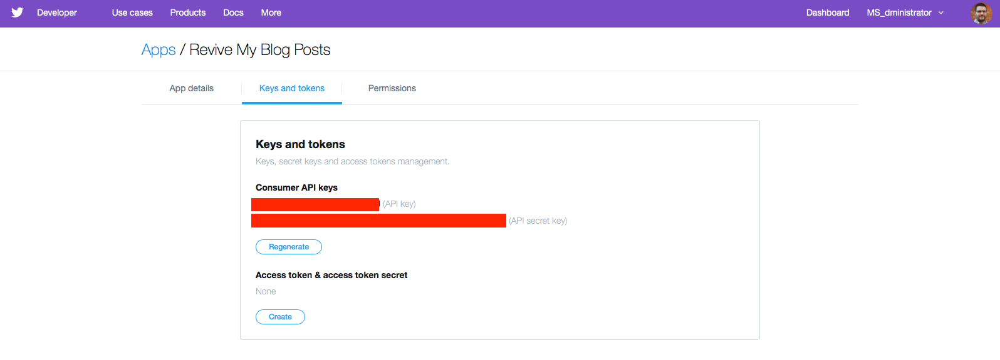
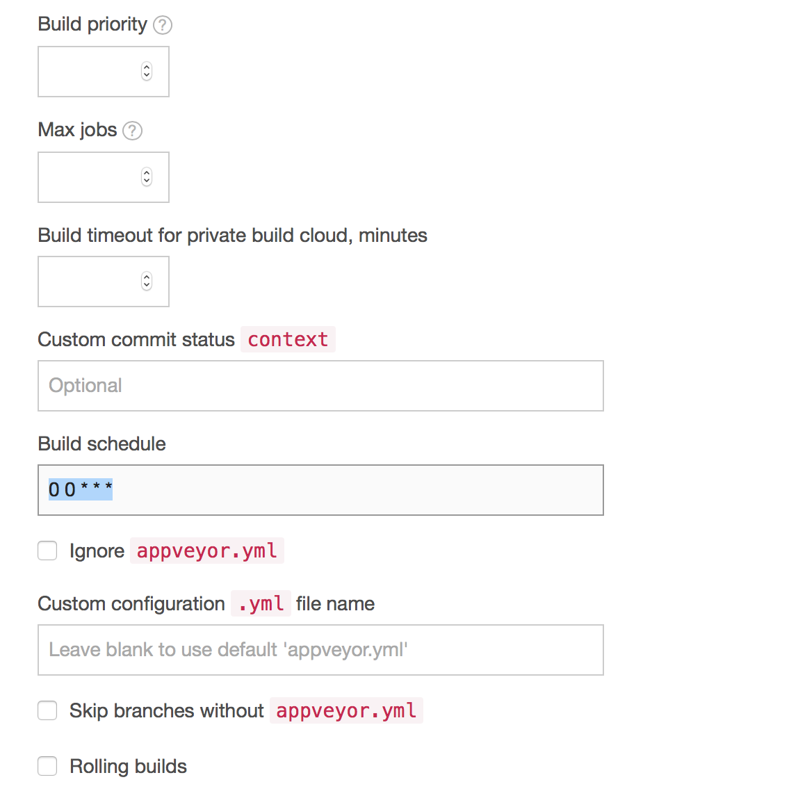

I am currently migrating my blog content from [Wordpress.com](https://wordpress.com) to GitHub pages using [Hugo](https://gohugo.io).  During this transition, I wanted to have the ability to "revive" my blog posts on a scheduled basis on social media (e.g. Twitter).  With Wordpress, you can use the WordPress [Revive Old Posts](https://wordpress.org/plugins/tweet-old-post/) plugin but with WordPress.com you have to have a premium business account to use plugins.

If you're in a similar situation of if you want a free way to automate the "re-posting" of your blog content then you're in luck!  Below I have listed some initial requirements that are needed to use this process.

* You blog has a xml RSS feed
* You will need a Twitter account and create a developer application
* You have a [GitHub](https://github.com) Account
* You will need a [AppVeyor](https://appveyor.com) Account

## RSS Feed

I am using Hugo to build and deploy my blog to GitHUb.  One of the great things with Hugo is that it automatically generates a RSS feed for me.  You can find my blogs RSS feed here: [https://msadministrator.github.io/index.xml](https://msadministrator.github.io/index.xml).  To use this method, your blog needs a RSS feed or some method of retrieving all of your past blog posts. Of course you could script this, but for this example I will be using a RSS feed.

## Twitter

To use this way of reviving your old blog posts you will need to have a Twitter account, but you will also need to generate some keys to post to twitter.  To do this, you will need to create a Twitter Application.

The first step is to visit [https://dev.twitter.com/apps/new](https://dev.twitter.com/apps/new) and create a new Twitter application.  When you create a new Twitter application you will need to provide the required information.


Next, you will need to select the "Keys and Tokens" tab and gather all your keys.  *Please keep these secure!*  We will be using them when we get to the AppVeyor section below.



## GitHub 

Once you have a GitHub account, you will need to create a new empty repository.  I called mine `ReviveBlogPostsCI` but you can name yours however you would like.  After you have created your GithUb repository, then go ahead and clone your empty repository to your local machine.

```
git clone git@github.com:{account_name}/ReviveBlogPostsCI.git
```

For now, we will keep this empty.  Before we add anything to our repository, we will need setup our account in AppVeyor if we have not done so already.

## AppVeyor

AppVeyor is a Continuous Integration product that is free for opensource projects.  It is mostly known to Windows developers that use GitHub, but there are many organizaitons that use it on a daily basis.  Most notabley is *Microsoft*.  

We first need to create an AppVeyor account. *You MUST create your AppVeyor account using your GitHUb credentials.  This is mandatory!* You can do this by visiting Appveyor.com and creating your account.


Once you have created your account, then you need to head back to AppVeyor and sign in.  Once signed in, then we need to select the "New Project" button.  If you are signed with your GitHub account then you should see a list of your repositories on the next page.  

Go ahead and select the repository we created earlier.

Depending on if you want to revive/re-post your blog posts on a scheduled basis or not, you will need to contact appveyor by emailing [team@appveyor.com](team@appveyor.com) to ask them to enable the "Scheduled Builds" feature within your account.  If you DO NOT want to schedule automatic "re-posting" of old blog posts then you can ignore this step.

Scheduled Builds allows you to schedule when the CI will run.  You can select a lot of different options as far as scheduling.  For my example, I have choosen to revive old posts twice a day at 11 AM and 6 PM.  

To set this type of schedule you would add the following to your project settings in AppVeyor (this is for only posting at 7PM CST daily):



If you would like to schedule your build for 7 PM CST then you add `0 0 * * *` into the Build Schedule.  If you would like your schedule to run twice a day; once at 11AM CST and again at 7PM CST then you would add the following to your Build Schedule:

```text
0 0,16 * * *
```

You can find out more about scheduled builds and how the patterns work here: [https://www.appveyor.com/docs/build-configuration/#scheduled-builds](https://www.appveyor.com/docs/build-configuration/#scheduled-builds)

## AppVeyor YAML

Previously, we setup and saved our Twitter API keys somewhere secure. We will be using these keys to make API calls to Twitter on a scheduled basis but we don't want to expose these keys publicly.  Luckily, AppVeyor provides a way to encrypt these values and use them in our CI build pipeline.

You can encrypt these values by visiting AppVeyor's encryption tool here [https://ci.appveyor.com/tools/encrypt](https://ci.appveyor.com/tools/encrypt).

Once you encrypt these values, we need to add them to a special file called `appveyor.yml`.  Here is an example of my YAML file here:

```yml
#          YAML Reference Guide: https://www.appveyor.com/docs/appveyor-yml/
# Environmental Variables Guide: https://www.appveyor.com/docs/environment-variables/
#                YAML Validator: https://ci.appveyor.com/tools/validate-yaml

# Disable automatic builds
# Without this, the following error shows up:
# "Specify a project or solution file. The directory does not contain a project or solution file."
build: off

#Environmental variables for Twitter API
environment:
  TwitterAPIKey:
    secure: T2bzCt5tixDJOZAr9tKvfFADNSmsSoo1MRmSc7ZSOi4=
  TwitterAPISecretKey:
    secure: J1/yUMcdB8A0VMBqIFlSC8lbxWcQyUDHKTr3eZWMHGIfxNrhfO4vFlT86PTqmO0QKQfe/HEsSZfwT+HoW0u/nQ==
  TwitterAccessToken:
    secure: wqBNHedxOUDZb6g1PbG+Ewx5kGxzYBsRXqzyKlOwRfekw/vNaMp2xEjII6PJJPPHf1TMs7ThbnLVjhQrRYUtQw==
  TwitterAccessTokenSecret:
    secure: epjLrmVSrzKq9ZYklfLtIKHuPTZaVZa8XId/cX9xfFbmevRYlZQBmhsChhqB2DYq

# Revive Old Blog Post and post to twitter via the API
install:
  - ps: |
      [Net.ServicePointManager]::SecurityProtocol = [Net.SecurityProtocolType]::Tls12
      $RevivePost = Invoke-RestMethod -Uri 'https://msadministrator.github.io/index.xml' | Get-Random
      Install-Module -Name PoshTwit -Force -Verbose 
      $TweetContent = "Blog Archive: " + $RevivePost.title + " " + $RevivePost.link
      $Tweet = @{ConsumerKey = $env:TwitterAPIKey; ConsumerSecret = $env:TwitterAPISecretKey; AccessToken = $env:TwitterAccessToken; AccessSecret = $env:TwitterAccessTokenSecret; Tweet = $TweetContent;}
      Publish-Tweet @Tweet
```

You can view my repository here [https://github.com/MSAdministrator/ReviveBlogPostsCI](https://github.com/MSAdministrator/ReviveBlogPostsCI) if you would like to see an example.

## Breakdown of `appveyor.yml` file

An YAML file is a configuration file that is commonly used by CI and CD infrastructure to specify the build configuration and the steps to take when building and/or deploying software.  This example is not typical in a traditional CI/CD setup but we are utilizing AppVeyor to pull down our latest blog posts and then select a random one to post/share (revive) to Twitter.

```yaml
#          YAML Reference Guide: https://www.appveyor.com/docs/appveyor-yml/
# Environmental Variables Guide: https://www.appveyor.com/docs/environment-variables/
#                YAML Validator: https://ci.appveyor.com/tools/validate-yaml

# Disable automatic builds
# Without this, the following error shows up:
# "Specify a project or solution file. The directory does not contain a project or solution file."
build: off
```

The top section of configuration values are not necessarily needed and are only used as an example.  Since we are not `building` any software then in our yaml file we are turning off the `build` step.

The next section is where we actually store our encrypted API keys we gathered from Twitter.  These are set in the `environment` section. By specifying the name of our variable(s) and the value it should contain after the `secure:` string, we are specifying new environmental variables and their values so that we can use them within our CI environment.

```yaml
#Environmental variables for Twitter API
environment:
  TwitterAPIKey:
    secure: T2bzCt5tixDJOZAr9tKvfFADNSmsSoo1MRmSc7ZSOi4=
  TwitterAPISecretKey:
    secure: J1/yUMcdB8A0VMBqIFlSC8lbxWcQyUDHKTr3eZWMHGIfxNrhfO4vFlT86PTqmO0QKQfe/HEsSZfwT+HoW0u/nQ==
  TwitterAccessToken:
    secure: wqBNHedxOUDZb6g1PbG+Ewx5kGxzYBsRXqzyKlOwRfekw/vNaMp2xEjII6PJJPPHf1TMs7ThbnLVjhQrRYUtQw==
  TwitterAccessTokenSecret:
    secure: epjLrmVSrzKq9ZYklfLtIKHuPTZaVZa8XId/cX9xfFbmevRYlZQBmhsChhqB2DYq
```

You can access these environmental variables by referencing them using the `$env:{SOME_VARIABLE_NAME}` syntax.  For Example, if you are wanting to use the value from the `TwitterAPIKey` you would use `$env:TwitterAPIKey` in your build scripts.

Lastly, we setup a specific build/deploy phase in our `appveyor.yml` configuration file to run a script or just run some code.  In this example, I am specifying that I want to open a PowerShell console and run some code (typically this is a script file). Since our the amount of code we are needing to use is fairly short, then I have opted to run the code here instead of inside of a script file.

```yaml
# Revive Old Blog Post and post to twitter via the API
install:
  - ps: |
      [Net.ServicePointManager]::SecurityProtocol = [Net.SecurityProtocolType]::Tls12
      $RevivePost = Invoke-RestMethod -Uri 'https://msadministrator.github.io/index.xml' | Get-Random
      Install-Module -Name PoshTwit -Force -Verbose 
      $TweetContent = "Blog Archive: " + $RevivePost.title + " " + $RevivePost.link
      $Tweet = @{ConsumerKey = $env:TwitterAPIKey; ConsumerSecret = $env:TwitterAPISecretKey; AccessToken = $env:TwitterAccessToken; AccessSecret = $env:TwitterAccessTokenSecret; Tweet = $TweetContent;}
      Publish-Tweet @Tweet
```

During the `install` phase of our pipeleine, we call `- ps: |` to call the following code using a PowerShell console. The `|` character in this context means that we want to run all the code that follows this call as 1 block of code. 

Lastly, the actual code to do all the "work" is doing the following:

* Set the the session to accept TLS 1.2
* Download my blogs RSS feed
* Get a random blog from my RSS feed
* Download and install `PoshTwit` from the PowerShell Gallery
* Create a tweet content string
* Submit the tweet using the Twitter API and our API Keys

## Final Step

Now that we have our `appveyor.yml` file ready, we now need to push our code to our GitHub repository.

```git
git add appveyor.yml
git commit -m 'Adding yaml file to revive old blog posts'
git push
```

That's it!  We now have a way to revive old twitter posts using completely free services!

If you have any suggestions or comments, please reach out to me on Twitter or on GitHub.