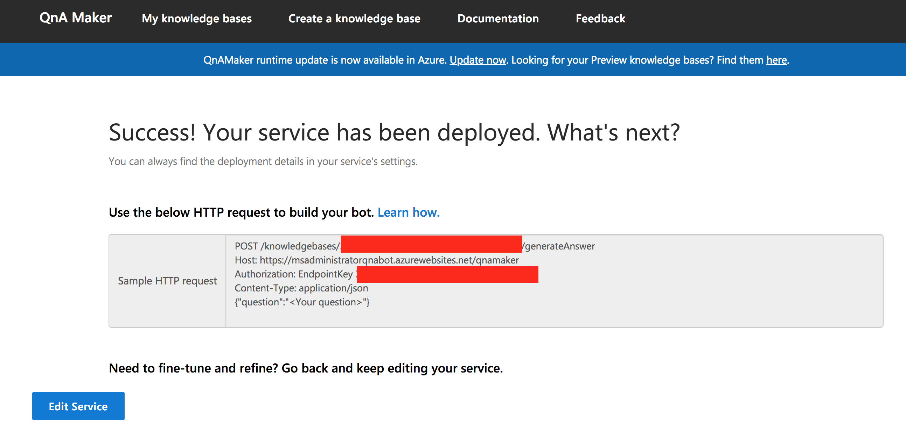

The first thing we need to do is login to [QnAMaker](https://qnamaker.ai).  QnA Maker is a Microsoft service that allows you to easily generate a bot using either existing documentation for a product (or service) or you can create your own questions and answers – hence the name QnA Maker.  

Login to QnAMaker and navigate to the Create a knowledge base tab.  You will need to walkthrough 5 steps to create your knowledge base.  Luckily, Microsoft has provided clear instructions to make this as simple as possible.

The 5 steps you will need to follow are:

* Create a QnA service in Microsoft Azure
* Connect to QnA service to you KB
* Name your KB
* Populate your KB
* Create your KB

## Step 1: Create a QnA service in Microsoft Azure

You will need to have access to a Microsoft Azure account to continue from this point.  If you do not have an Azure account, you can [get a free trial](https://azure.microsoft.com/en-us/offers/ms-azr-0044p/) ($200 Azure Credits).  On step 1, click the Create a QnA service button.  You should be directed [here](https://portal.azure.com/#create/Microsoft.CognitiveServicesQnAMaker).

Once logged in, you will need to provide some information to create the new QnA service.  Once you have filled out the required fields then click Create.  You will be redirected to your Azure Portal dashboard while the service is being created.

## Step 2: Connect to QnA service to you KB

Navigate back to your previous tab (qnamaker.ai) and scroll down to Step 2.  You will need to select, from the next three dropdown menu’s, the appropriate resources to use.  For me, step 2 looks like the following screenshot.

If for some reason your QnA service is NOT listed in the dropdown, you will need to reload the website to get it to populate correctly.

## Step 3: Name your KB

This step is really straightforward; name your knowledge base.  

## Step 4: Populate your KB

There are several different ways to populate your knowledge base (KB).  You can point QnAMaker to a URL or upload a document that contains information you would like your bot to use as your questions and answers.  

For my example, I am going to be using a FAQ markdown page provided by the PowerShell team.  [Here is the full URL](https://github.com/PowerShell/PowerShell/blob/master/docs/FAQ.md)

## Step 5: Create your KB

After you have selected to populate your knowledge base by a URL, uploaded document, or decided to wait to manually add your knowledge base data, you should now select the Create your KB button.  

Depending on how you chose to populate your knowledge base, this may take no time at all or a few minutes.  

Once your knowledge base is created, you should be presented with a screen that looks similar to the following screenshot (depending on your knowledge base source).  QnAMaker does a really decent job of parsing input to create your knowledge base “key value pair” (e.g. database).  If you want to add, delete, or modify any of the existing questions and answers you can do so now.

At the top of your knowledge base you have several tabs.  Once you have modified your questions and answers, you should select Save and train.  Again, depending on the changes you made this may take no time or a few minutes.  

Once you have saved, you can either go ahead and Publish your QnA knowledge base or you can test it out.  If you select Test it will provide a chat window to test out our bots’ questions and answer’s capabilities.  

If you enter a question and do NOT receive the expected response, you can modify both the answer and add an alternative question to help train the QnAMaker bot.  

Now, go ahead and select Save and train.  Finally, let’s select Publish to publish our knowledge base to be used by our bot service.

Once completed, you should be redirected to a Success! Your service has been deployed page with some crucial information you will need for the next few steps.